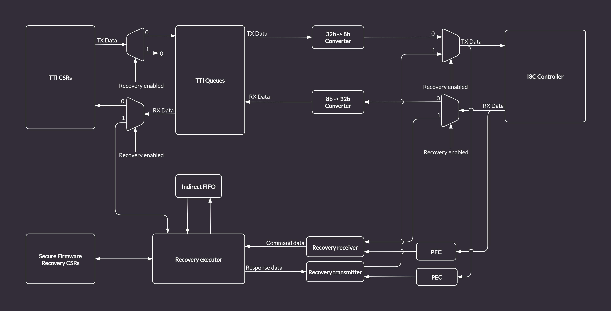
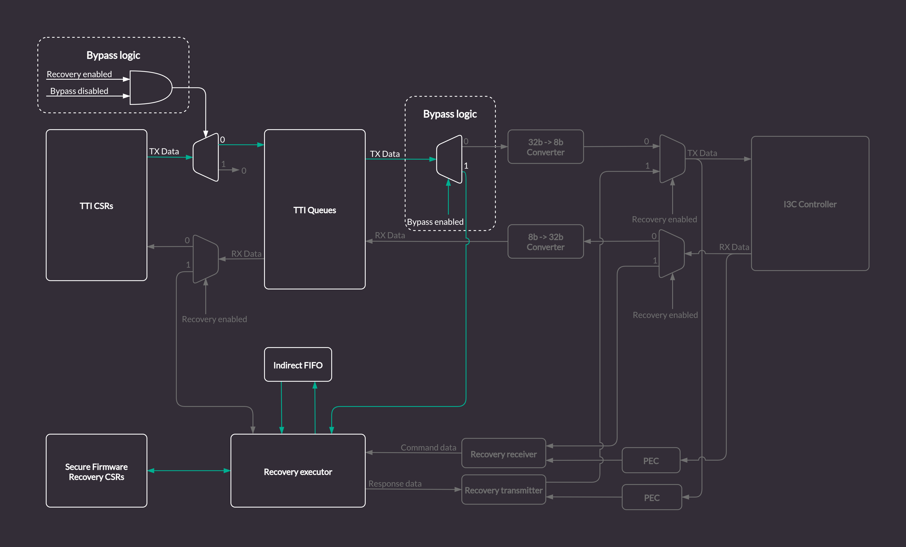

# AXI Recovery Flow

This chapter describes the AXI-based firmware recovery flow, which allows
driving recovery data from within the SoC over the AXI bus, bypassing I3C
communication. For the standard I3C-based recovery flow, see {doc}`recovery_flow`.

## Overview

The recovery flow transfers firmware images from an external source through
the I3C core's Indirect FIFO to the Device Firmware. Three actors participate:

| Actor | Role |
|-------|------|
| **Image Provider** | SoC-internal firmware that reads images from storage and writes them to `TTI_TX_DATA_PORT` via AXI (the hardware routes these writes into the Indirect FIFO when bypass mode is enabled) |
| **I3C Core** | Hosts the OCP recovery registers and Indirect FIFO |
| **Device Firmware** | Reads images from the Indirect FIFO, validates, and boots them |

The Image Provider and Device Firmware operate **concurrently** and synchronize
through shared OCP recovery registers in the I3C core.

## Prerequisite

Enable AXI bypass mode before starting recovery:

```
REC_INTF_CFG.REC_INTF_BYPASS = 1
```

This routes data directly from the AXI bus to the Indirect FIFO, bypassing
the I3C protocol logic. The Device Firmware operates identically in both I3C
and AXI bypass modes.

```{warning}
Once set, `REC_INTF_BYPASS` must not be cleared until the next system
reset. This is a one-time configuration for the life of the reset domain.
```

## Multi-Stage Recovery Flow

The recovery flow transfers one or more images in sequence. Each image is
identified by a `REC_IMG_INDEX` value. The number of stages and their content
are platform-defined. A typical three-stage example:

| Stage | REC_IMG_INDEX | Description |
|-------|---------------|-------------|
| 0 | 0x0 | Primary firmware image |
| 1 | 0x1 | Configuration / manifest |
| 2 | 0x2 | Application firmware |

Each stage follows the same handshake protocol. The timeline below shows the
interleaved register operations between the Image Provider and Device Firmware
for a single stage. Steps marked with the same number happen concurrently.

### Per-Stage Timeline

```
  Image Provider                             I3C Core Regs           Device Firmware
  --------------                             -------------           ---------------
          |                                      |                       |
          |                                      |              1. Write PROT_CAP
          |                                      |                 (recovery caps)
          |                                      |                       |
          |                                      |              2. Write DEVICE_STATUS_0
          |                                      |                 .DEV_STATUS = 0x3
          |                                      |                 (recovery mode)
          |                                      |                       |
          |                                      |              3. Write RECOVERY_STATUS
          |                                      |                 .DEV_REC_STATUS = 0x1
          |                                      |                 .REC_IMG_INDEX = <stage>
          |                                      |                 (awaiting image)
          |                                      |                       |
  4. Read PROT_CAP_2                             |                       |
     verify recovery capability                  |                       |
          |                                      |                       |
  5. Poll DEVICE_STATUS_0                        |                       |
     until DEV_STATUS == 0x3                     |                       |
          |                                      |                       |
  6. Poll RECOVERY_STATUS                        |                       |
     until DEV_REC_STATUS == 0x1                 |                       |
     Read REC_IMG_INDEX to determine             |                       |
     which image Device Firmware expects         |                       |
          |                                      |                       |
  7. Clear REC_INTF_CFG                          |                       |
     .REC_PAYLOAD_DONE = 0                       |                       |
          |                                      |                       |
  8. Write INDIRECT_FIFO_CTRL_1                  |                       |
     .IMAGE_SIZE = image size in 4B              |                       |
     units (i.e. byte count / 4)                 |                       |
          |                                      |                       |
          v                                      |                       |
  ,-------------------------------.              |                       |
  | 9. DATA TRANSFER LOOP         |              |                       |
  |   (Provider writes,           |              |                       |
  |    Device FW reads)           |              |                       |
  `-------------------------------'              |                       |
          |                                      |                       |
          |  Poll FIFO_STATUS_0.EMPTY            |  DMA triggered by     |
          |  Write chunk to TTI_TX_DATA_PORT     |  payload_available_o  |
          |  (max transfer size per chunk)       |  (reads FIFO_SIZE or  |
          |                                      |  remaining bytes)     |
          |      ... repeat until all data transferred ...               |
          |                                      |                       |
 10. Write REC_INTF_CFG                          |                       |
     .REC_PAYLOAD_DONE = 1                       |                       |
     (signal last chunk sent)                    |                       |
          |                                      |                       |
          |                                      |          11. Write DEVICE_STATUS_0
          |                                      |              .DEV_STATUS = 0x4
          |                                      |              (recovery pending)
          |                                      |                       |
          |                                      |          12. Poll RECOVERY_CTRL
          |                                      |              .ACTIVATE_REC_IMG
          |                                      |              until == 0xF
          |                                      |                       |
 13. Poll DEVICE_STATUS_0                        |                       |
     until DEV_STATUS == 0x4                     |                       |
     (Device FW finished reading,                |                       |
     waiting for activation)                     |                       |
          |                                      |                       |
 14. Write REC_INTF_REG_W1C_ACCESS               |                       |
     .RECOVERY_CTRL_ACTIVATE_REC_IMG             |                       |
     = 0xF (triggers image_activated_o)          |                       |
          |                                      |                       |
          |                                      |          15. Write DEV_REC_STATUS = 0x2
          |                                      |              (processing image)
          |                                      |                       |
 16. Poll DEVICE_STATUS_0.DEV_STATUS             |                       |
     Wait while DEV_STATUS == 0x4                |                       |
     (Device FW is validating the image)         |                       |
          |                                      |                       |
          |                                      |          17. Validate image
          |                                      |              (crypto verification)
          |                                      |                       |
          |                                      |              [Intermediate, on success]
          |                                      |              Clear ACTIVATE_REC_IMG
          |                                      |              Reset INDIRECT_FIFO_CTRL_0
          |                                      |              -> loop back to step 2
          |                                      |              (with next REC_IMG_INDEX)
          |                                      |                       |
          |                                      |              [On error (any stage)]
          |                                      |              Write DEV_REC_STATUS >= 0xc
          |                                      |              Write DEV_STATUS = 0xF
          |                                      |                       |
          |                                      |              [Final stage, on success]
          |                                      |              Write DEV_REC_STATUS = 0x3
          |                                      |              Write DEV_STATUS = 0x1
          |                                      |              (recovery successful,
          |                                      |              device healthy)
          |                                      |                       |
 18. DEV_STATUS changed from 0x4:                |                       |
       0x3 = next stage ready                    |                       |
             -> go back to step 5                |                       |
       0x1 = recovery complete                   |                       |
             -> exit                             |                       |
       0xF = error                               |                       |
             -> abort recovery                   |                       |
          |                                      |                       |
```

### Stage-Specific Details

**Intermediate stages:**
- Device Firmware validates the received image (e.g. crypto verification)
- On success, Device Firmware clears `ACTIVATE_REC_IMG`, resets the
  Indirect FIFO via `INDIRECT_FIFO_CTRL_0.RESET`, and loops back to
  step 2 (writing the next `REC_IMG_INDEX`)
- Image Provider detects `DEV_REC_STATUS == 0x1` at step 18 and loops
  back to step 5

**Final stage:**
- Same data transfer handshake as intermediate stages
- On success, Device Firmware writes `DEV_REC_STATUS = 0x3` (recovery
  successful) and `DEV_STATUS = 0x1` (device healthy)
- On error, Device Firmware writes `DEV_REC_STATUS >= 0xc` and
  `DEV_STATUS = 0xF`
- Image Provider detects `DEV_REC_STATUS == 0x3` at step 18 and exits

```{important}
**Intermediate stage completion**: For all stages except the final one,
Device Firmware clears `ACTIVATE_REC_IMG`, resets the Indirect FIFO via
`INDIRECT_FIFO_CTRL_0.RESET`, and loops back to step 2 to signal
readiness for the next image. The FIFO reset is performed by Device
Firmware, not the Image Provider. Device Firmware writes `DEV_STATUS = 0x3`
last (at step 2), after all cleanup is complete.

**Final stage completion**: After the final stage, Device Firmware
writes `DEV_REC_STATUS = 0x3` (recovery successful) and
`DEV_STATUS = 0x1` (device healthy). The Image Provider polls for
this transition at step 16/18 to confirm recovery is complete.
```

```{note}
Once `REC_INTF_BYPASS` is set to 1, it must not be cleared until the
next system reset. The bypass setting is effectively a one-time
configuration for the life of the reset domain. FW must not write
`REC_INTF_BYPASS = 0` after recovery completes.
```

### Authentication Error Handling

If Device Firmware fails to authenticate a pushed image at any stage, it
writes an error status to `RECOVERY_STATUS.DEV_REC_STATUS` (>= 0xc) and
sets `DEVICE_STATUS_0.DEV_STATUS = 0xF`. The recovery flow terminates
immediately -- no further stages are executed. See OCP Recovery v1.1
Section 7.6 for the full list of `DEV_REC_STATUS` error codes.

The Image Provider should check for error status (`DEV_STATUS == 0xF`)
at step 16 of each stage. If an error is detected, the Image Provider
should terminate the recovery flow. No retry is attempted.

```{note}
The Image Provider should not poll indefinitely for a success status
without also checking for error conditions. Device Firmware may report
an authentication or activation error at any stage. An Image Provider
that only polls for DEV_STATUS == 0x3 (next stage) or == 0x1 (success)
will hang if Device Firmware writes DEV_STATUS = 0xF instead.
```

## Register Reference

Recovery registers are part of the Secure Firmware Recovery Interface
extended capability. See {ref}`tab-secure-firmware-recovery-interface` in
{doc}`ext_cap` for the full register list and field descriptions.

The AXI bypass flow also uses two registers from the SoC Management Interface:

- `REC_INTF_CFG.REC_INTF_BYPASS` -- enables AXI bypass mode
- `REC_INTF_CFG.REC_PAYLOAD_DONE` -- signals last chunk written
- `REC_INTF_REG_W1C_ACCESS` -- sideband write path for `RECOVERY_CTRL`
  and `INDIRECT_FIFO_CTRL` (needed because AXI bypass skips the I3C
  Recovery Handler that normally writes these registers)

## Data Transfer Constraints

- Maximum chunk size per FIFO write is defined by `INDIRECT_FIFO_STATUS_4`
- Image Provider must poll `INDIRECT_FIFO_STATUS_0.EMPTY` after each chunk to
  ensure Device Firmware has drained the FIFO before writing the next chunk
- Device Firmware uses `recovery_payload_available_o` as a DMA trigger.
  Each assertion of `payload_available_o` signals that the Indirect FIFO
  contains a complete chunk (or the final partial chunk) ready for reading.
  The DMA reads either the full FIFO contents or, for the last chunk of an
  image, only the remaining bytes. Once the DMA drains the FIFO,
  `payload_available_o` deasserts and the DMA waits for the next assertion.
- `payload_available_o` asserts in bypass mode when the Indirect FIFO is
  full, `REC_PAYLOAD_DONE` is set, or the image has been activated. It
  deasserts when the FIFO is empty.
- `REC_PAYLOAD_DONE` must be set after the last chunk and cleared after
  activation

## AXI Bypass Architecture

In the default I3C mode, the Recovery Handler translates I3C bus traffic into
recovery register accesses. The bypass feature routes AXI writes directly to
the Indirect FIFO, disabling the I3C communication logic.

:::{figure-md} recovery_handler


Recovery Handler in the I3C Core (standard I3C mode)
:::

With bypass enabled, Image Provider writes to `TTI_TX_DATA_PORT` over AXI.
The hardware forwards those writes through the TTI TX Queue into the Indirect
Data FIFO. Device Firmware reads from the Indirect FIFO over AXI identically
to the I3C flow.

:::{figure-md} recovery_handler_with_bypass


Recovery Handler with AXI bypass (green arrows show bypass data path)
:::

AXI transactions may be filtered using the AXI ID field
(see {doc}`axi_id_filtering`).
