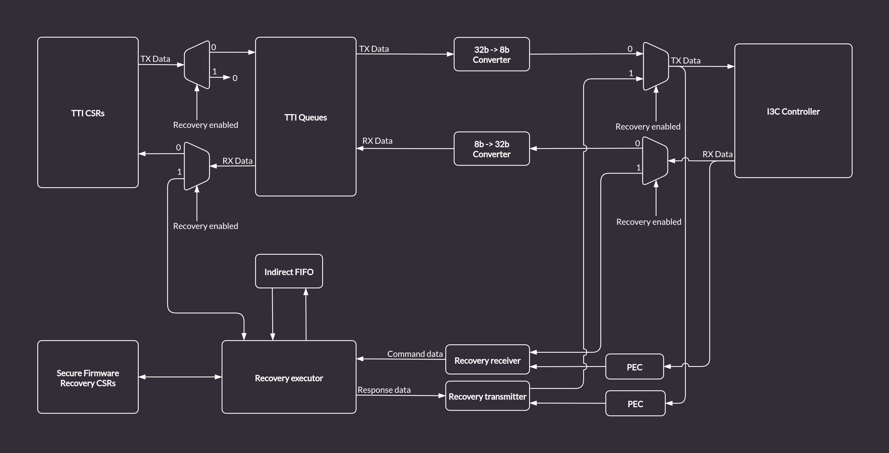

# AXI driven Caliptra recovery flow

This chapter discusses the implementation of AXI based recovery flow, which is an alternative to the standard I3C based flow (see {doc}`recovery_flow`).
This feature allows driving the recovery data from within the SoC integrating the I3C core over the AXI bus, bypassing I3C communication.

## AXI Recovery flow implementation

The AXI recovery flow reuses the logic already present in the I3C core used in the Caliptra-SS design, with a runtime option essentially bypassing most of the I3C core communication logic (including the I3C recovery flow logic).

The loopback functionality is configurable via a CSR, with the I3C mode set as the default.

Recovery CSRs are accessible from the internal AXI bus.
The transactions to the core may be filtered using the AXI ID field (see {doc}`axi_id_filtering`)

The logic is implemented so that the recovery firmware in the Caliptra RoT ROM can operate without any changes.

### AXI-based recovery procedure

The Caliptra MCU RISC-V core is responsible for driving the data copied from an external memory (e.g. QSPI interface) to the recovery FIFOs.
The ROM running on the MCU core monitors the recovery block registers and performs the recovery flow.
During the boot procedure the ROM will have to follow the following procedure:

1. Set the I3C block to the "direct AXI" mode
2. Poll the `DEVICE_STATUS` register and wait for the recovery to be enabled by the Caliptra core
3. Read the `RECOVERY_STATUS` register and check if the recovery flow started
4. Write to the `RECOVERY_CONTROL` register to set the recovery image configuration
5. Write to the `INDIRECT_FIFO_CTRL` register to set the recovery image size
6. Push the recovery image to the recovery interface FIFOs:

   a. Read the `INDIRECT_FIFO_STATUS` register to determine remaining space in the indirect FIFO
   b. If the indirect FIFO is not full, write a chunk of data to the `INDIRECT_FIFO_DATA` register
   c. The above steps should be repeated until the whole recovery image is written to the FIFO

7. Activate the new image by writing to the `RECOVERY_CTRL` register
8. Read the `RECOVERY_STATUS` register to ensure the image has been activated

The recovery image will be written in chunks with length equal to or less than `Max transfer size` defined in the `INDIRECT_FIFO_STATUS` register.
Once the last data chunk is written to the FIFO, the Caliptra MCU ROM will write a CSR in the Secure Firmware Recovery register file indicating the transfer is complete.

## Recovery Handler bypass

In the regular (I3C) mode of the core, the Recovery Handler strongly relies on communication with the I3C Core internal logic by interfacing with TTI Queues.
The bypass implementation modifies the I3C Core logic to allow direct access over the AXI bus to the structures specified by the OCP Secure Firmware Recovery for compliance with the [Caliptra Subsystem Recovery Sequence](https://github.com/chipsalliance/Caliptra/blob/main/doc/Caliptra.md#caliptra-subsystem-recovery-interface-hardware).

The default design of the Recovery Handler includes many blocks specifically designed to translate I3C bus traffic into recovery messages.
It also automatically responds to the I3C commands by writing transaction descriptors and data for the TTI Queues.
Such a recovery flow is presented in the diagram below.

:::{figure-md} recovery_handler

Recovery Handler in the I3C Core
:::

In order enable an alternative recovery mechanism while reusing the existing logic and keeping compliance with Caliptra, the I3C core provides a custom bypass feature allowing direct communication with the Recovery Handler via the AXI bus.
The bypass disables the I3C communication logic.
Data is routed from the TTI TX Queue to the Recovery Executor block, and written directly to the Indirect Data FIFO.
The Caliptra ROM can access the data from the Indirect FIFO over the AXI bus (the same way it does in the regular I3C recovery flow).
Data flow in bypass mode, marked with green arrows, is depicted in the diagram below.

:::{figure-md} recovery_handler_with_bypass

Recovery Handler with the I3C Core logic bypass
:::

## Secure Firmware Recovery CSRs

With the bypass feature enabled, the FIFO status CSRs in the Secure Firmware Recovery CSR file will be updated by the Recovery Handler module.
However, some registers like e.g. `INDIRECT_FIFO_CTRL` which are updated by I3C commands in a standard recovery flow, will have to be accessed and configured properly from the software running on the Caliptra MCU via the AXI bus.
All configurable registers are writable from software, read only registers provide status information about Recovery Handler internals, e.g. details about size and fill level of the Indirect FIFO.
