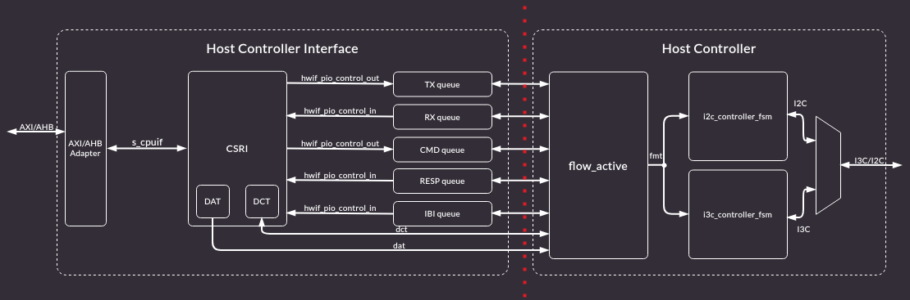
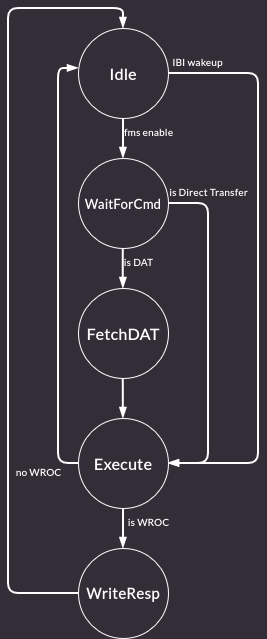

# I3C Controller overview

## Architecture

The design is partitioned into two primary subsystems: the **Host Controller Interface (HCI)** and the **Host Controller (HC)**. These subsystems communicate via command/response queues and shared lookup tables (DAT/DCT).

### High-Level Block Diagram

:::{figure-md} fig-hc-top

High-Level Block Diagram
:::

### Subsystems
* **HCI (Host Controller Interface):**
    * **Interface:** AXI/AHB (Slave interface).
    * **Function:** Handles communication with the Host CPU. It populates Control and Status Registers (CSRs) and transfers relevant information between the CSRs and the internal hardware queues (Command, Response, TX, RX, IBI).
* **HC (Host Controller):**
    * **Function:** Reads operational data from the queues and translates them into physical I3C transactions (driving SDA/SCL output signals).
    * **Components:** Consists of the `flow_active` module (protocol logic) and the low-level PHY FSMs (`i3c_controller_fsm` / `i2c_controller_fsm`).

### Data Flow
1.  **Command Generation:** Software writes commands to HCI CSRs.
2.  **Queue Population:** HCI logic pushes these commands into the Command Queue.
3.  **Execution:** HC fetches commands, consults the Device Address Table (DAT) or Device Characteristics Table (DCT), and executes the transaction on the bus.
4.  **Response:** Results are written back to the Response Queue for software to read.

---

## Features List

### Host Controller Interface (HCI)
* **Registers (RDL):** Full implementation of the Register Description List for configuration and status monitoring.
* **Queues:** Support for Command, Response, TX, RX, and IBI queues.
* **Tables:**
    * **DAT (Device Address Table):** Storage for Dynamic Addresses and device types.
    * **DCT (Device Characteristics Table):** Storage for device-specific parameters (PID, BCR, DCR).

### Controller Core Logic
* **SDA Arbitration Management:** Handling of bus arbitration during Start/Restart phases.
* **Frame Generation:**
    * **Read Frame:** Support for SDR Read transactions with and without `7'h7E` I3C address.
    * **Write Frame:** Support for SDR Write transactions with and without `7'h7E` I3C address.
* **IBI Handling:** Detection and processing of In-Band Interrupts from Targets.
* **HDR Pattern Generation:**
    * **HDR Exit Pattern:** Logic to generate the specific sequence to exit High Data Rate modes (ensuring bus reset/compatibility).
* **Error Handling:** Target Error Detection and Escalation mechanisms.

### Common Command Codes (CCC)

The I3C Controller includes support for the following subset of CCCs required for basic bus management and initialization.

#### Broadcast Support
* **ENEC:** Enable Events Command (Broadcast).
* **DISEC:** Disable Events Command (Broadcast).
* **RSTDAA:** Reset Dynamic Address Assignment (Broadcast).
* **ENTDAA:** Enter Dynamic Address Assignment (Broadcast).
* **SETAASA:** Set All Addresses to Static Address (Broadcast).

#### Direct Support
* **ENEC:** Enable Events Command (Direct).
* **DISEC:** Disable Events Command (Direct).
* **SETDASA:** Set Dynamic Address from Static Address (Direct).
* **SETNEWDA:** Set New Dynamic Address (Direct).
* **GETPID:** Get Provisional ID (Direct).
* **GETBCR:** Get Bus Characteristics Register (Direct).
* **GETDCR:** Get Device Characteristics Register (Direct).
* **GETSTATUS:** Get Device Status (Direct).

#### Dynamic Address Assignment (DAA)

The controller implements Dynamic Address Assignment (DAA) in accordance with the bus initialization sequence defined in the **I3C Basic Specification (Section 5.1.4.2)** and the usage guidelines for the `ENTDAA` CCC in the **I3C HCI Specification (Section 8.4.1.1)**.

When configuring the DAA procedure, software developers must adhere to the following guidelines:

1. **Pre-populate the DAT:** All Device Address Table (DAT) entries for targets awaiting a dynamic address must be fully populated **before** initiating the DAA procedure with the `ENTDAA` CCC. 
2. **Handling Unassigned Targets:** If the specified `DEV_COUNT` number of dynamic addresses has been successfully assigned, but unaddressed devices still remain on the bus, the controller will return a value of `0x1` in the `DATA_LENGTH` field of the Response Descriptor. This signals to the host that at least one target device still requires an address.
3. **DCT Initialization:** The Device Characteristics Table (DCT) Index always starts at `0`.

### In-Band Interrupts (IBI)

The I3C Controller supports the detection and servicing of In-Band Interrupts (IBIs) initiated by target devices.
The controller can recognize and process these interrupts whether they are raised during a Bus Available condition or during arbitrable address headers.

#### IBI Rejection and DAT Lookup
Before accepting an IBI, the controller validates the request against the target's Device Address Table (DAT) entry.
When a target drives its dynamic address onto the bus during an IBI request, the controller utilizes a **reverse lookup table** to quickly resolve this dynamic address back to the target's specific DAT index. 

Once the corresponding DAT entry is retrieved, the controller checks its configuration fields to decide whether to acknowledge (ACK) or reject (NACK) the interrupt.
The IBI is automatically rejected if the bitwise condition `IBI_REJECT | ~IBI_PAYLOAD` is met.
Specifically:
* **`IBI_REJECT`:** If this field is set (`1`), the controller explicitly rejects all IBI requests from this target.
* **`~IBI_PAYLOAD`:** If the `IBI_PAYLOAD` field is clear (`0`), the controller will also reject the IBI, ensuring that targets not explicitly authorized to send payload data are denied.

#### IBI Data Packing
When an accepted IBI is processed, the controller writes the resulting data into the `PIOCONTROL.IBI_PORT` CSR.
To ensure efficient reading by the host software, the IBI data is packed into the 32-bit port in the following sequence:

1. **IBI Status Descriptor:** The first 32-bit word (DWORD) written to the port is always the IBI Status Descriptor. This descriptor contains vital metadata about the interrupt, including the `data_length` (in bytes) of the incoming payload as well as the dynamic address of the target issuing the IBI.
2. **Payload Data:** The Status Descriptor is immediately followed by the actual IBI data payload. The data is chunked and written as `(data_length + 3) / 4` DWORDs.
3. **Mandatory Data Byte (MDB) Placement:** If the target sends a Mandatory Data Byte (MDB), it is always packed into the Least Significant Byte (LSB) of the very first data DWORD immediately following the Status Descriptor.

#### Internal Buffer & Overflow Handling
In accordance with the I3C HCI Specification (Section 6.9.1, *IBI Handling in PIO Mode*), the controller utilizes an internal hardware buffer to temporarily hold the target's optional IBI data bytes during the read transaction. 

* **Overflow Condition:** If a target attempts to send a number of optional bytes that is **greater than or equal to** the internal buffer size, the controller will flag an error and immediately abort the IBI transaction.
* **Data Retention:** In the event of a buffer overflow and subsequent abort, the controller recovers by writing the first *buffer size* bytes (the maximum data it successfully captured before the abort) into the `IBI_PORT`.

### Error Conditions

The MVP supports the following ERROR_STATUS conditions from Table 1 Error Status Codes in Response Descriptor I3C TCRI Spec.

:::{list-table} Error Status Codes
:name: error-status-codes
:widths: 15 10 10 20
:header-rows: 1

* - **Error Code**
  - **ERR_STATUS Value**
  - **I3C TCRI Spec Section**
  - **Notes**
* - CRC
  - 0x1
  - 6.4.1.1
  - 
* - PARITY
  - 0x2
  - 6.4.1.2
  - 
* - FRAME
  - 0x3
  - 6.4.1.3
  - 
* - ADDR_HEADER
  - 0x4
  - 6.4.1.4
  - 
* - NACK
  - 0x5
  - 6.4.1.5
  - 
* - OVL
  - 0x6
  - 6.4.1.6
  - 
* - I3C_SHORT_READ_ERR
  - 0x7
  - 6.4.1.7
  - 
* - HC_ABORTED
  - 0x8
  - 6.4.1.8
  - 
* - I2C_WR_DATA_NACK or BUS_ABORTED
  - 0x9
  - 6.4.1.9
  - 
* - NOT_SUPPORTED
  - 0xA
  - 6.4.1.10
  - 
* - ABORTED_WITH_CRC
  - 0xB
  - 6.4.1.11
  - This is used as an internal default state for errors. This means that internal hardware bugs can mistakenly produce the AbortedWithCRC error status.
* - Transfer Type Specific
  - 0xC – 0xF
  - 6.4.1.12
  - 
:::

---

## Microarchitecture

The Host Controller (HC) logic is split into a "decode" stage (Flow Active FSM) and "execute" stage (i3c/i2c controller FSM).

### `flow_active` (Decode FSM)
This module acts as a decoder. It consumes raw data from queues and converts it into control signals (`fmt_*` signals) for the downstream controller FSMs.
Control and data are handled strictly in 9-bit blocks (1 byte + T-bit/ACK). Once the sending or receiving of a 9-bit block begins, the process cannot be aborted halfway through.

#### Operating Principle
* **Interfaces:**
    * **Upstream:** Read/Write access to HCI Queues (Cmd, Resp, Tx, Rx, IBI).
    * **Downstream:** `fmt` interface (`fmt_byte_o` + flags) to `i2c_controller_fsm` / `i3c_controller_fsm`.
* **Operating Principle:**
    * Operates in **PIO Mode** (Programmed I/O) using **SDR** (Standard Data Rate).
    * `fmt_byte_o` is the data, that will be sent on the I3C bus.
* **FSM States & Transitions:**
    1.  **Idle:** Waits for `i3c_fsm_en_i` signal indicating a new command is present in the Command Queue or IBI to wake up FSM.
    2.  **WaitForCmd:** Fetches the 64-bit Command Descriptor from the Command Queue.
    3.  **FetchDAT:** Retrieves the Device Address Table (DAT) entry corresponding to the command's Device Index. Transitions to the execution stage based on `cmd_attr` (Command Attribute).
    4.  **Execution:**
        * *I2C Write Immediate / I3C Write Immediate*: uses immediate command descriptor format and reads data directly  from the command descriptor.
        * *I2C Write Regular / I3C Write Regular*: uses regular command descriptor format and reads data from TX Queue
        * *I2C Read / I3C Read*: uses regular command descriptor format and writes data into RX Queue
    5.  **WriteResp:** Generates a Response Descriptor, loads it into the Response Queue, and returns to **Idle**.

:::{figure-md} fig-flow-active-fsm

Flow Active FSM 
:::

#### Signal List

:::{list-table} `flow_active` IO
:name: flow_active_io
:widths: 30 5 25 40
:width: 100%

* - **Signal**
  - **Direction**
  - **Width**
  - **Description**

* - `clk_i`
  - input
  - 1
  - Clock
* - `rst_ni`
  - input
  - 1
  - Active low reset
* - `cmd_queue_full_i`
  - input
  - 1
  - Command FIFO queue full flag
* - `cmd_queue_ready_thld_i`
  - input
  - `HciCmdThldWidth`
  - Command FIFO ready threshold
* - `cmd_queue_ready_thld_trig_i`
  - input
  - 1
  - Command FIFO ready threshold trigger
* - `cmd_queue_empty_i`
  - input
  - 1
  - Command FIFO empty flag
* - `cmd_queue_rvalid_i`
  - input
  - 1
  - Command FIFO read valid
* - `cmd_queue_rready_o`
  - output
  - 1
  - Command FIFO read ready
* - `cmd_queue_rdata_i`
  - input
  - `HciCmdDataWidth`
  - Command FIFO read data
* - `rx_queue_full_i`
  - input
  - 1
  - RX FIFO queue full flag
* - `rx_queue_start_thld_i`
  - input
  - `HciRxThldWidth`
  - RX FIFO start threshold
* - `rx_queue_start_thld_trig_i`
  - input
  - 1
  - RX FIFO start threshold trigger
* - `rx_queue_ready_thld_i`
  - input
  - `HciRxThldWidth`
  - RX FIFO ready threshold
* - `rx_queue_ready_thld_trig_i`
  - input
  - 1
  - RX FIFO ready threshold trigger
* - `rx_queue_empty_i`
  - input
  - 1
  - RX FIFO empty flag
* - `rx_queue_wvalid_o`
  - output
  - 1
  - RX FIFO write valid
* - `rx_queue_wready_i`
  - input
  - 1
  - RX FIFO write ready
* - `rx_queue_wdata_o`
  - output
  - `HciRxDataWidth`
  - RX FIFO write data
* - `tx_queue_full_i`
  - input
  - 1
  - TX FIFO queue full flag
* - `tx_queue_start_thld_i`
  - input
  - `HciTxThldWidth`
  - TX FIFO start threshold
* - `tx_queue_start_thld_trig_i`
  - input
  - 1
  - TX FIFO start threshold trigger
* - `tx_queue_ready_thld_i`
  - input
  - `HciTxThldWidth`
  - TX FIFO ready threshold
* - `tx_queue_ready_thld_trig_i`
  - input
  - 1
  - TX FIFO ready threshold trigger
* - `tx_queue_empty_i`
  - input
  - 1
  - TX FIFO empty flag
* - `tx_queue_rvalid_i`
  - input
  - 1
  - TX FIFO read valid
* - `tx_queue_rready_o`
  - output
  - 1
  - TX FIFO read ready
* - `tx_queue_rdata_i`
  - input
  - `HciTxDataWidth`
  - TX FIFO read data
* - `resp_queue_full_i`
  - input
  - 1
  - Response FIFO queue full flag
* - `resp_queue_ready_thld_i`
  - input
  - `HciRespThldWidth`
  - Response FIFO ready threshold
* - `resp_queue_ready_thld_trig_i`
  - input
  - 1
  - Response FIFO ready threshold trigger
* - `resp_queue_empty_i`
  - input
  - 1
  - Response FIFO empty flag
* - `resp_queue_wvalid_o`
  - output
  - 1
  - Response FIFO write valid
* - `resp_queue_wready_i`
  - input
  - 1
  - Response FIFO write ready
* - `resp_queue_wdata_o`
  - output
  - `HciRespDataWidth`
  - Response FIFO write data
* - `ibi_queue_full_i`
  - input
  - 1
  - IBI FIFO queue full flag
* - `ibi_queue_ready_thld_i`
  - input
  - `HciIbiThldWidth`
  - IBI FIFO ready threshold
* - `ibi_queue_ready_thld_trig_i`
  - input
  - 1
  - IBI FIFO ready threshold trigger
* - `ibi_queue_empty_i`
  - input
  - 1
  - IBI FIFO empty flag
* - `ibi_queue_wvalid_o`
  - output
  - 1
  - IBI FIFO write valid
* - `ibi_queue_wready_i`
  - input
  - 1
  - IBI FIFO write ready
* - `ibi_queue_wdata_o`
  - output
  - `HciIbiDataWidth`
  - IBI FIFO write data
* - `dat_mem_sink_i`
  - input
  - `dat_mem_sink_t`
  - DAT memory interface
* - `dat_read_valid_hw_o`
  - output
  - 1
  - DAT read valid HW
* - `dat_index_hw_o`
  - output
  - `$clog2(\`DAT_DEPTH)`
  - DAT index HW
* - `dat_rdata_hw_i`
  - input
  - 64
  - DAT read data HW
* - `dct_write_valid_hw_o`
  - output
  - 1
  - DCT write valid HW
* - `dct_read_valid_hw_o`
  - output
  - 1
  - DCT read valid HW
* - `dct_index_hw_o`
  - output
  - `$clog2(\`DCT_DEPTH)`
  - DCT index HW
* - `dct_wdata_hw_o`
  - output
  - 128
  - DCT write data HW
* - `dct_rdata_hw_i`
  - input
  - 128
  - DCT read data HW
* - `host_enable_o`
  - output
  - 1
  - Enable host functionality
* - `is_i2c_transfer_o`
  - output
  - 1
  - Is an I2C transfer flag
* - `i2c_cmd_complete_i`
  - input
  - 1
  - I2C command complete flag
* - `phy_sel_od_pp_i`
  - input
  - 1
  - PHY select OD/PP input
* - `phy_sel_od_pp_o`
  - output
  - 1
  - PHY select OD/PP output
* - `fmt_fifo_rvalid_o`
  - output
  - 1
  - Format FIFO read valid
* - `fmt_fifo_depth_o`
  - output
  - `I2CFifoDepthWidth`
  - Format FIFO depth
* - `fmt_fifo_rready_i`
  - input
  - 1
  - Format FIFO read ready
* - `fmt_fifo_rdone_i`
  - input
  - 1
  - Format FIFO read done
* - `fmt_byte_o`
  - output
  - 8
  - Format TX byte output
* - `fmt_bit_o`
  - output
  - 1
  - Format TX bit output (T bit)
* - `fmt_flag_start_before_o`
  - output
  - 1
  - Format flag: start before
* - `fmt_flag_restart_after_o`
  - output
  - 1
  - Format flag: restart after
* - `fmt_flag_stop_after_o`
  - output
  - 1
  - Format flag: stop after
* - `fmt_flag_read_continuous_o`
  - output
  - 1
  - Format flag: read continue
* - `fmt_receive_nack_i`
  - input
  - 1
  - Format receive NACK
* - `fmt_sda_arbitration_i`
  - input
  - 1
  - SDA line arbitration is detected
* - `fmt_byte_i`
  - input
  - 8
  - Format RX byte input
* - `fmt_bit_i`
  - input
  - 1
  - Format RX bit input
* - `fmt_flag_read_bytes_o`
  - output
  - 1
  - Format flag: read bytes
* - `fmt_flag_read_valid_i`
  - input
  - 1
  - Format flag: read valid
* - `fmt_flag_nak_ok_o`
  - output
  - 1
  - Format flag: NAK OK
* - `fmt_flag_hdr_exit_o`
  - output
  - 1
  - Format flag: HDR exit
* - `unhandled_unexp_nak_o`
  - output
  - 1
  - Unhandled unexpected NAK
* - `unhandled_nak_timeout_o`
  - output
  - 1
  - Unhandled NAK timeout
* - `rx_fifo_wvalid_i`
  - input
  - 1
  - I2C Controller RX FIFO write valid
* - `rx_fifo_wdata_i`
  - input
  - `RxFifoWidth`
  - I2C Controller RX FIFO write data
* - `i3c_fsm_en_i`
  - input
  - 1
  - I3C FSM enable
* - `i3c_fsm_idle_o`
  - output
  - 1
  - I3C FSM idle status
* - `pio_rs_i`
  - input
  - 1
  - PIO RS input
* - `halt_on_cmd_seq_timeout_i`
  - input
  - 1
  - Halt on command sequence timeout
* - `resume_i`
  - input
  - 1
  - HC_CONTROL.RESUME CSR field
* - `abort_i`
  - input
  - 1
  - HC_CONTROL.ABORT | PIO_CONTROL.ABORT CSR fields
* - `err`
  - output
  - `i3c_err_t`
  - I3C Error structure
* - `irq_o`
  - output
  - `i3c_irq_t`
  - I3C Interrupt structure

:::

### `i3c_controller_fsm` (Execute / Timing FSM for I3C)
This module acts as the main controller of the I3C bus, handling the serialization of data and generation of the Start (S), Stop (P) and repeated Start (Sr) conditions. It also handles switching between Open Drain mode and Push Pull mode, also respecting the different timing requirements (See 6.2 Timing Specification I3C Basic Spec).

#### Operating Principle
* **Function:**
    * Consumes `fmt` signals (byte data + control flags like Start/Stop/Nak) from the [`flow_active`](#flow-active-decode-fsm) module.
    * Drives physical **SDA** and **SCL** lines.
    * **Timing FSM:** Generates the SCL clock based on I3C SDR timing requirements (in Open Drain and Push Pull mode).
    * **Serialization:** Serializes the `fmt_byte` onto the SDA line for write transactions.
    * **Parallelization:** Parallelizes received data into a `fmt_byte` for the [`flow_active`](#flow-active-decode-fsm) module for read transactions.
    * **Protocol Framing:** Reacts to `fmt_flag_start` and `fmt_flag_stop` to generate Start/Stop conditions, as well as `fmt_flag_restart` to generate a repeated Start condition.

#### Signal List

:::{list-table} `i3c_controller_fsm` IO
:name: i3c_controller_fsm_io
:widths: 30 5 25 40
:width: 100%

* - **Signal**
  - **Direction**
  - **Width**
  - **Description**

* - `clk_i`
  - input
  - 1
  - Clock
* - `rst_ni`
  - input
  - 1
  - Active low reset
* - `ctrl_scl_i`
  - input
  - 1
  - Interface to SCL input
* - `ctrl_sda_i`
  - input
  - 1
  - Interface to SDA input
* - `ctrl_scl_o`
  - output
  - 1
  - Interface to SCL output
* - `ctrl_sda_o`
  - output
  - 1
  - Interface to SDA output
* - `ctrl_bus_i`
  - input
  - `bus_state_t`
  - Bus state
* - `phy_sel_od_pp_o`
  - output
  - 1
  - PHY select Open-Drain/Push-Pull output
* - `is_i2c_transfer_i`
  - input
  - 1
  - Is I2C transfer flag
* - `thigh_i`
  - input
  - `i3c_pkg::TimingWidth`
  - High period of the SCL in clock units
* - `tlow_i`
  - input
  - `i3c_pkg::TimingWidth`
  - Low period of the SCL in clock units
* - `thigh_od_i`
  - input
  - `i3c_pkg::TimingWidth`
  - High period of the SCL in clock units (Open-Drain Mode)
* - `thigh_od_init_i`
  - input
  - `i3c_pkg::TimingWidth`
  - High period of the SCL in clock units (Open-Drain Mode during init procedure)
* - `tlow_od_i`
  - input
  - `i3c_pkg::TimingWidth`
  - Low period of the SCL in clock units (Open-Drain Mode)
* - `t_r_i`
  - input
  - `i3c_pkg::TimingWidth`
  - Rise time of both SDA and SCL in clock units
* - `t_f_i`
  - input
  - `i3c_pkg::TimingWidth`
  - Fall time of both SDA and SCL in clock units
* - `thd_sta_od_i`
  - input
  - `i3c_pkg::TimingWidth`
  - Hold time for START in clock units (Open-Drain Mode)
* - `thd_rsta_i`
  - input
  - `i3c_pkg::TimingWidth`
  - Hold time for repeated START in clock units
* - `tsu_rsta_i`
  - input
  - `i3c_pkg::TimingWidth`
  - Setup time for repeated START in clock units
* - `tsu_sto_i`
  - input
  - `i3c_pkg::TimingWidth`
  - Setup time for STOP in clock units
* - `t_ds_od_i`
  - input
  - `i3c_pkg::TimingWidth`
  - Setup time for SDA during START in clock units (Open-Drain Mode)
* - `tsu_dat_i`
  - input
  - `i3c_pkg::TimingWidth`
  - Data setup time in clock units
* - `thd_dat_i`
  - input
  - `i3c_pkg::TimingWidth`
  - Data hold time in clock units
* - `t_buf_i`
  - input
  - `i3c_pkg::TimingWidth`
  - Bus free time between STOP and START in clock units
* - `t_bus_idle_i`
  - input
  - `i3c_pkg::TimingWidth`
  - Bus IDLE condition time in clock units
* - `t_bus_available_i`
  - input
  - `i3c_pkg::TimingWidth`
  - Bus AVAILABLE condition time in clock units
* - `fmt_fifo_rvalid_i`
  - input
  - 1
  - Format FIFO read valid
* - `fmt_fifo_rready_o`
  - output
  - 1
  - Format FIFO read ready
* - `fmt_fifo_rdone_o`
  - output
  - 1
  - Format FIFO read done
* - `fmt_byte_i`
  - input
  - 8
  - Format TX byte input
* - `fmt_bit_i`
  - input
  - 1
  - Format TX bit input (T bit)
* - `fmt_flag_start_before_i`
  - input
  - 1
  - Format flag: start before
* - `fmt_flag_stop_after_i`
  - input
  - 1
  - Format flag: stop after
* - `fmt_flag_restart_after_i`
  - input
  - 1
  - Format flag: restart after
* - `fmt_receive_nack_o`
  - output
  - 1
  - Format receive NACK
* - `fmt_sda_arbitration_o`
  - output
  - 1
  - SDA line arbitration is detected
* - `fmt_byte_o`
  - output
  - 8
  - Format RX byte output
* - `fmt_bit_o`
  - output
  - 1
  - Format RX bit output (T bit)
* - `fmt_flag_read_bytes_i`
  - input
  - 1
  - Format flag: read bytes
* - `fmt_flag_read_continuous_i`
  - input
  - 1
  - Format flag: read continue
* - `fmt_flag_read_valid_o`
  - output
  - 1
  - Format flag: read valid
* - `fmt_flag_hdr_exit_i`
  - input
  - 1
  - Format flag: HDR exit

:::

### `i2c_controller_fsm` (Execute / Timing FSM for I2C)
This module acts as the main controller of the I2C bus, handling the serialization of data and generation of the Start (S), Stop (P) and repeated Start (Sr) conditions. It handles the I2C timing requirements (See 6.2 Timing Specification I3C Basic Spec). Note that all transactions in I2C are in Open Drain mode. This module is taken from the [Open Titan I2C Core](https://opentitan.org/book/hw/ip/i2c/index.html).

#### Operating Principle
* **Function:**
    * Consumes `fmt` signals (byte data + control flags like Start/Stop/Nak) from the [`flow_active`](#flow-active-decode-fsm) module.
    * Drives physical **SDA** and **SCL** lines.
    * **Timing FSM:** Generates the SCL clock based on I3C SDR timing requirements (in Open Drain and Push Pull mode).
    * **Serialization:** Serializes the `fmt_byte` onto the SDA line for write transactions.
    * **Parallelization:** Parallelizes received data into a `fmt_byte` for the [`flow_active`](#flow-active-decode-fsm) module for read transactions.
    * **Protocol Framing:** Reacts to `fmt_flag_start` and `fmt_flag_stop` to generate Start/Stop conditions. (Differently to the [`i3c_controller_fsm`](#i3c-controller-fsm-execute-timing-fsm-for-i3c) this module does not have a `fmt_repeated_start` flag. It generates a repeated start by setting the `fmt_flag_start`.) 

#### Signal List

:::{list-table} `i2c_controller_fsm` IO
:name: i2c_controller_fsm_io
:widths: 30 5 25 40
:width: 100%

* - **Signal**
  - **Direction**
  - **Width**
  - **Description**

* - `clk_i`
  - input
  - 1
  - Clock
* - `rst_ni`
  - input
  - 1
  - Active low reset
* - `scl_i`
  - input
  - 1
  - Interface to SCL input
* - `scl_o`
  - output
  - 1
  - Interface to SCL output
* - `sda_i`
  - input
  - 1
  - Interface to SDA input
* - `sda_o`
  - output
  - 1
  - Interface to SDA output
* - `host_enable_i`
  - input
  - 1
  - Enable host functionality
* - `fmt_fifo_rvalid_i`
  - input
  - 1
  - Indicates there is valid data in format FIFO
* - `fmt_fifo_depth_i`
  - input
  - `FifoDepthWidth`
  - Format FIFO depth
* - `fmt_fifo_rready_o`
  - output
  - 1
  - Populates format FIFO
* - `fmt_byte_i`
  - input
  - 8
  - Byte in format FIFO to be sent to target
* - `fmt_flag_start_before_i`
  - input
  - 1
  - Issue START before sending byte
* - `fmt_flag_stop_after_i`
  - input
  - 1
  - Issue STOP after sending byte
* - `fmt_flag_read_bytes_i`
  - input
  - 1
  - Indicates byte is a number of reads
* - `fmt_flag_read_continue_i`
  - input
  - 1
  - Host to send ACK to final byte read
* - `fmt_flag_nak_ok_i`
  - input
  - 1
  - No ACK is expected
* - `unhandled_unexp_nak_i`
  - input
  - 1
  - Unhandled unexpected NAK
* - `unhandled_nak_timeout_i`
  - input
  - 1
  - NACK handler timeout event not cleared
* - `rx_fifo_wvalid_o`
  - output
  - 1
  - High if there is valid data in RX FIFO
* - `rx_fifo_wdata_o`
  - output
  - `RxFifoWidth`
  - Byte in RX FIFO read from target
* - `host_idle_o`
  - output
  - 1
  - Indicates the host is idle
* - `thigh_i`
  - input
  - `i3c_pkg::TimingWidth`
  - High period of the SCL in clock units
* - `tlow_i`
  - input
  - `i3c_pkg::TimingWidth`
  - Low period of the SCL in clock units
* - `t_r_i`
  - input
  - `i3c_pkg::TimingWidth`
  - Rise time of both SDA and SCL in clock units
* - `t_f_i`
  - input
  - `i3c_pkg::TimingWidth`
  - Fall time of both SDA and SCL in clock units
* - `thd_sta_i`
  - input
  - `i3c_pkg::TimingWidth`
  - Hold time for (repeated) START in clock units
* - `tsu_sta_i`
  - input
  - `i3c_pkg::TimingWidth`
  - Setup time for repeated START in clock units
* - `tsu_sto_i`
  - input
  - `i3c_pkg::TimingWidth`
  - Setup time for STOP in clock units
* - `tsu_dat_i`
  - input
  - `i3c_pkg::TimingWidth`
  - Data setup time in clock units
* - `thd_dat_i`
  - input
  - `i3c_pkg::TimingWidth`
  - Data hold time in clock units
* - `t_buf_i`
  - input
  - `i3c_pkg::TimingWidth`
  - Bus free time between STOP and START in clock units
* - `stretch_timeout_i`
  - input
  - 31
  - Max time target connected to this host may stretch the clock (UNUSED)
* - `timeout_enable_i`
  - input
  - 1
  - Assert if target stretches clock past max (UNUSED)
* - `host_nack_handler_timeout_i`
  - input
  - 31
  - Timeout threshold for unhandled Host-Mode 'nak' IRQ (UNUSED)
* - `host_nack_handler_timeout_en_i`
  - input
  - 1
  - Enable for host NACK handler timeout
* - `event_nak_o`
  - output
  - 1
  - Target didn't ACK when expected (UNUSED)
* - `event_unhandled_nak_timeout_o`
  - output
  - 1
  - SW didn't handle the NACK in time (UNUSED)
* - `event_scl_interference_o`
  - output
  - 1
  - Other device forcing SCL low (UNUSED)
* - `event_sda_interference_o`
  - output
  - 1
  - Other device forcing SDA low (UNUSED)
* - `event_stretch_timeout_o`
  - output
  - 1
  - Target stretches clock past max time (UNUSED)
* - `event_sda_unstable_o`
  - output
  - 1
  - SDA is not constant during SCL pulse (UNUSED)
* - `event_cmd_complete_o`
  - output
  - 1
  - Command is complete

:::

---

## SRAM Macros

The internal memory structures for the Device Address Table (DAT) and Device Characteristic Table (DCT) are implemented using the OpenTitan generic single-port RAM macro (`prim_generic_ram_1p`). 

This parameterized module provides standard wrapper for synchronous single-port SRAM instantiation. The source code for this macro can be referenced in the `i3c-core` repository: [`prim_generic_ram_1p.sv`](https://github.com/chipsalliance/i3c-core/blob/main/src/libs/mem/prim_generic_ram_1p.sv).

:::{list-table} Used SRAM Macros
:name: sram_macros_table
:widths: 40 20 20 20
:width: 75%

* - **Memory Block**
  - **Width (Bits)**
  - **Depth (Words)**
  - **Size**

* - **DAT** (Device Address Table)
  - 64
  - 32
  - 2 kbit

* - **DCT** (Device Characteristic Table)
  - 128
  - 32
  - 4 kbit

:::
