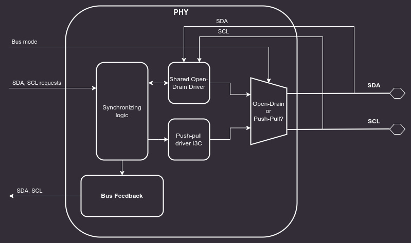

# Physical Layer

This chapter provides a description of the I3C PHY Layer logic.

## Common PHY Layer

The PHY is responsible for controlling external bus signals (SDA, SCL) and synchronizing them with an internal clock. It should also support bus arbitration.
The [I2C Core](https://opentitan.org/book/hw/ip/i2c/index.html) from the OpenTitan project can be used as a reference design for basic features of the PHY.

:::{figure-md} i3c_phy


Block diagram of the I3C PHY Layer
:::

### SDA and SCL lines (5.1.3.1)

Both I2C and I3C datasheets specify that SDA and SCL lines should be bidirectional, connected to an active Open Drain class Pull-Up.
Bus lines should be HIGH unless any device ties them to the GROUND.

:::{note}
In addition to the active Open Drain class Pull-Up, a High-Keeper is also required on the Bus.
The High-Keeper on the Bus should be strong enough to prevent system leakage from pulling SDA, and sometimes SCL, Low.
The High-Keeper on the Bus should also be weak enough for a Target with the minimum I{sub}`OL` PHY to be able to pull SDA, SCL, or both Low within the Minimum t{sub}`DIG_L` period.

The High-Keeper should be implemented during the physical design.
PHY driver strength modeling will not be performed in this project.
Base Controller will be delivered without the High-Keeper, however, it may become a configuration option later on.
:::

Each bus line must be capable of switching between 4 logic states:

1. No Pull-Up (High-Z)
2. High-Keeper Pull-Up
3. Open Drain Pull-Up
4. Assert LOW

The OpenTitan I2C Core implements a [Virtual Open Drain](https://opentitan.org/book/hw/ip/i2c/doc/theory_of_operation.html#virtual-open-drain) functionality which seems like a good solution for implementing the desired behavior on FPGA devices, while at the same time keeping it easy to use in silicon chips. Each bus line consists of 3 lines:

1. Signal input (`scl_i`, `sda_i`) - external input from the bus lines.
2. Signal output (`scl_o`, `sda_o`) - internal signal, it is tied to the GROUND.
3. Signal output enable (`scl_en_o`, `sda_en_o`) - internal signal enable, controlled by the core FSM.

This interface makes it easy to construct tri-state buffers.
The controller will never assert the external bus lines HIGH, since it is assumed that these lines are pulled up to V{sub}`dd` externally.
Switching from output to input is enough to achieve signals asserted HIGH.

Verilator does not natively support `x` and `z` states and their handling is explained in the [official documentation](https://verilator.org/guide/latest/languages.html?highlight=tristate#tri-inout).
Cocotb requires a wrapper to interact properly with an `inout`, which is described in [Cocotb discussion #3506](https://github.com/cocotb/cocotb/discussions/3506).
Considering these limitations, PHY is being tested functionally using Cocotb and tri-state logic.
Additionally, there is an RTL testbench run in Verilator and Icarus simulators that checks whether High-Z is set properly on I3C bus lines when the controller requests a high bus state.

### Clock synchronization (5.1.7)

The entire core functions in a single clock domain - all I3C bus signals are sampled with this clock.

### I3C timing configuration

The core implements 4 CSRs for controlling timings of the I3C bus:

* `T_F_REG` - SCL falling time
* `T_R_REG` - SCL rise time
* `T_HD_DAT_REG` - SDA hold time
* `T_SU_DAT_REG` - SDA setup time

In the target configuration, the first three should be set to `0`, the `T_SU_DAT_REG` should be set according to the following equation:

```
reg_val = $floor(3 / system_clock_period) - 1
T_SU_DAT_REG = reg_val > 0 ? reg_val : 0
```

The core supports system clock frequencies above 333MHz, and SCL frequencies up to 12.5MHz. Below 333MHz Tsco I3C timing requirement of 12ns is not met. I3C specification defines Tsco as “Clock to Data Turnaround Time: The time duration between reception of an SCL edge and the start of driving an SDA change”. With 333MHz clock the maximum response time from the core is 12ns. This timing is not affected by the chip pads delays as per MIPI CSI I3C 1.1.1 specification.

The I3C core needs 3 system clock cycles between an event on a SCL line and driving the SDA. Since SCL and core clock are asynchronous, SCL can drop just after rising edge of the system clock. Such situation adds an additional clock cycle latency resulting in 4 cycles in total.

Maximal I3C core Tsco can be calculated with the Tsco = 4 * Tsys_clk formula , where Tsys_clk is a system clock period.

```{warning}
The minimum frequency calculation (333MHz) accounts only for the
I3C core internal logic delay. It does **not** include timing delays
introduced to and from the PADs. Integrators must account for these additional
delays when selecting the system clock frequency. 
```

Future core releases will enable the GETMXDS CCC support allowing the core to advertise longer Tsco times for lower system clock frequencies.


### SDA Output Path and Output Enable

The SDA output path uses a dedicated output enable (`sda_oe`) signal in addition to the
data value (`sda_o`). The `bus_tx_flow` module computes both based on the drive mode
(Open Drain or Push-Pull) and the data value being transmitted:

```
sda_oe = drive_mode_is_pushpull OR (NOT data_msb)
```

The resulting truth table for the SDA pad:

| sel_od_pp | sda_o | sda_oe | IO State |
|-----------|-------|--------|----------|
| 0 (OD) | 0 | 1 | Drive Low |
| 0 (OD) | 1 | 0 | High-Z (released) |
| 1 (PP) | 0 | 1 | Drive Low |
| 1 (PP) | 1 | 1 | Drive High |

In Open Drain mode, the pad is released (High-Z) when driving a logical 1, allowing
the external pull-up to assert the line. In Push-Pull mode, the pad actively drives
both high and low.

The PHY module (`i3c_phy.sv`) passes these signals through to the pad interface:

- `ctrl_sda_oe_i` -> `ctrl_sda_oe_o` (output enable passthrough)
- `sel_od_pp_i` -> `sel_od_pp_o` (drive mode passthrough)

### I/O Signal Routing Constraints

All six I3C bus I/O signals (`scl_i`, `sda_i`, `scl_o`, `sda_o`, `scl_oe`, `sda_oe`)
must be routed together in physical design. The two-flop synchronizers
(`scl_synchronizer`, `sda_synchronizer`) and the output-path flops should be placed
close to the I/O pads to minimize routing skew between input and output paths.

Keeping the synchronizing flops and output flops near each other and near the pads
ensures that:

1. Input sampling latency is minimized and consistent across SCL and SDA.
2. Output drive timing (t{sub}`SCO`) is not degraded by long internal routing.
3. Skew between `sda_o` / `sda_oe` and the corresponding `sda_i` sample point
   remains within the timing budget described in the
   [I3C timing configuration](#i3c-timing-configuration) section above.

```{note}
The `sel_od_pp_o` (Open Drain / Push-Pull select) signal should also be routed
alongside `sda_o` and `sda_oe` since it directly controls the pad driver mode
and must be stable before the pad switches drive state.
```
