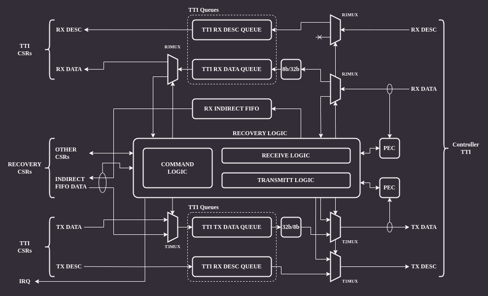

# Recovery flow

The recovery flow is implemented according to the Open Compute Secure Firmware Recovery standard v1.1-rc5.
The recovery mode is handled through the virtual I3C target implemented by the core.
In the Recovery Mode the Recovery Initiator Device (e.g. BMC) is primarily responsible for streaming the Firmware Recovery Image to the I3C Core.
In order to facilitate this process, the I3C Core implements CSRs as specified in the [Secure Firmware Recovery Interface](ext_cap.md#secure-firmware-recovery-interface---0xc0).
The firmware is responsible for implementing the recovery flow and transferring firmware data to the program memory.

The recovery flow adheres to the following steps:

1. Upon reset, the hardware sets the FIFO size and region type in the `INDIRECT_FIFO_STATUS` CSR
1. The device's firmware configures the I3C core and sets the appropriate bits in the `PROT_CAP` CSR to indicate its recovery capabilities
   These must include the mandatory ones:
   - bit 0 (`DEVICE_ID`)
   - bit 4 (`DEVICE_STATUS`)
   - bit 6 (`Local C-image support`) or bit 7 (`Push C-image support`)
   - bit 5 (`INDIRECT_CTRL`), only if bit 7 is set
1. Upon request for recovery mode entry, the firmware writes `0x3` (Recovery mode) to `DEVICE_STATUS`
1. The Recovery Initiator writes to `INDIRECT_FIFO_CTRL` to inform the Recovery handler about the image size
   - Component Memory Space (`CMS`) field is set to `0`
1. The Recovery Initiator writes a data chunk to the receive FIFO via the `INDIRECT_FIFO_DATA` CSR.
   The I3C core responds with a NACK when the FIFO is full.
1. The Recovery Handler updates FIFO pointers (Read Index and Write Index) presented in the `INDIRECT_FIFO_STATUS` CSR
1. The device's firmware reacts to a signal that a data chunk has been written to the FIFO by polling the `INDIRECT_FIFO_STATUS` CSR
1. The device's firmware reads the data chunk from the FIFO and stores it in an appropriate location in the memory
1. Steps 5 to 8 are repeated until the Recovery handler detects that the whole firmware image has been transmitted
1. The device's firmware polls the `RECOVERY_CONTROL` register until it receives the "Activate image" command from the Recovery Initiator
1. The device's firmware updates the `RECOVERY_STATUS` CSR to indicate that the uploaded firmware is being booted

## Recovery handler

Since the OCP Secure Firmware Recovery standard describes a set of CSRs that are the interface between the device being updated and the Recovery Initiator, I3C transactions that access them must be handled in the logic instead of the firmware, which is the purpose of the Recovery Handler block.

When the recovery mode is active, the handler takes over the TTI interface of the controller.

:::{figure-md} recovery_handler

Recovery handler
:::

The architecture of the Recovery Handler module is shown in the block diagram below:

:::{figure-md} recovery_handler_bd

Recovery handler architecture
:::

The module's backend is connected directly to the controller's TTI interface.
There are several muxes on the RX and TX data paths which allow bypassing the module in normal operation mode and remove/inject data in recovery mode.
There are two `PEC` (Packet Error Code) blocks responsible for calculating CRC for RX and TX data paths.
The CRC algorithm operates on individual bytes and implements C(x) = x^8+x^2+x^1+1 polynomial (see MCTP I3C binding, section 5.3.1).
The frontend is connected to I3C core CSRs accessible by software.

### Normal operation

When the recovery mode is disabled  the core allows accessing only a subset of recovery mode CSRs over I3C on the virtual target address.
These are the registers marked as "available anytime" by the recovery interface specification.
An attempt to access other CSRs results in a NACK response.

### Recovery operation

When the recovery mode is enabled all recovery CSRs can be accessible via I3C bus.
Accesses to the registers must be performed via the virtual target address.

## CSR access via I3C

Recovery mode CSRs are accessible through the I3C bus. The following protocol is used to implement read/write operations:

### CSR write

:::{figure-md} csr_write

CSR write
:::

The Recovery Initiator sends a command byte, followed by 16-bit payload length LSB and MSB bytes using I3C private transfers.
The payload data immediately follows the length bytes.
Each transfer ends with an additional byte containing a Packet Error Code (PEC) checksum.

### CSR read

:::{figure-md} csr_read

CSR read
:::

For CSR read, the Recovery Initiator sends only the command byte and PEC checksum.
Next, it issues a repeated start and begins a private read transaction.
The device responds by sending data length LSB and MSB bytes, followed by the data and PEC.

## Recovery handler operation

The main job of the Recovery Handler is providing hardware means for an active controller to access CSRs relevant to the recovery operation.

### CSR write

When the Recovery Initiator tries to write to a CSR through I3C, it first sends the command byte followed by two length bytes which are received by the handler logic.
If the length is non-zero, the handler resets the `PEC` block and sets `R2MUX` to pass the remaining data to the TTI RX data queue.
`R2MUX` disconnects the queue just before the last byte, which is the PEC checksum.
Finally, the last byte is compared with the checksum computed by the `PEC` block.

If the checksum matches the command, the handling part of the handler logic reads data from the TTI RX data queue and updates relevant CSR fields.

If the checksum does not match, then the handler discards all the data in the queue.

In case of an `INDIRECT_FIFO_DATA` write command the handler does not process the data at all. Instead, it passes the data to the RX indirect FIFO queue to make it available to the software.
When the software reads data from the `INDIRECT_FIFO_DATA` CSR, the handler updates the queue pointer in the `INDIRECT_FIFO_STATUS` CSR.

### CSR read

A CSR read begins similarly as write, by receiving the command byte.
Following that, the command handling part reads data from the CSR being read and passes it to the transmit part, which formats the response I3C packet.

The transmit logic injects the CSR length, resets the TX `PEC` module, sends the CSR content to the I3C core and finally injects the calculated PEC checksum.
