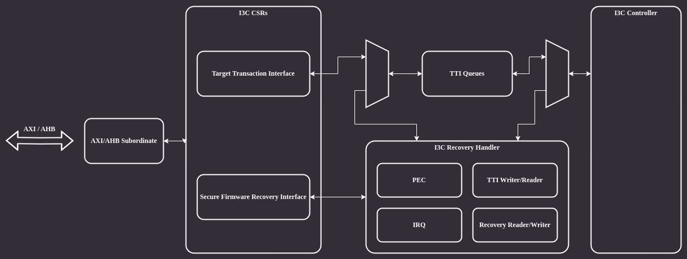
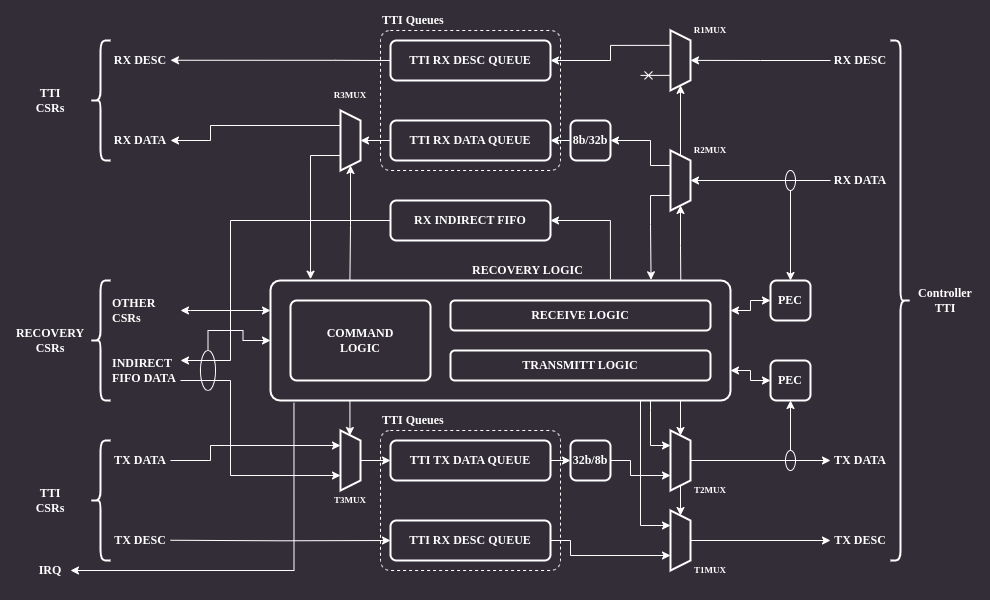
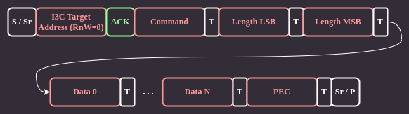
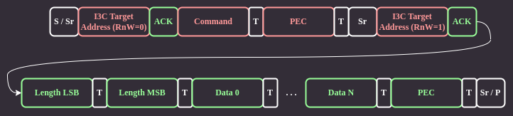

# Recovery flow

The recovery flow is implemented according to the Open Compute Secure Firmware Recovery standard v1.1-rc5.
The recovery mode is handled through the virtual I3C target implemented by the core.
In the Recovery Mode the Recovery Initiator Device (e.g. BMC) is primarily responsible for streaming the Firmware Recovery Image to the I3C Core.
In order to facilitate this process, the I3C Core implements CSRs as specified in the [Secure Firmware Recovery Interface](ext_cap.md#secure-firmware-recovery-interface---0xc0).
The firmware is responsible for implementing the recovery flow and transferring firmware data to the program memory.

```{note}
For the alternative AXI-based recovery flow, see {doc}`axi_recovery_flow`.
```

## Recovery Flow Actors

| Actor | Interface | Role |
|-------|-----------|------|
| **Recovery Initiator** | I3C bus (virtual target addr) | BMC or Controller that sends firmware image |
| **I3C Core** | Recovery Handler HW | Translates I3C commands to recovery CSR accesses |
| **Device Firmware** | AXI bus | Reads FIFO data, manages recovery state, boots image |

## Recovery Flow Timeline

The diagram below shows the interleaved operations between the three actors.
All CSR accesses from the Recovery Initiator use I3C private transfers to the
virtual target address. Device Firmware accesses CSRs over the AXI bus.

```
  Recovery Initiator            I3C Core (Recovery CSRs)    Device Firmware
  (I3C Bus)                     ------------------------    ---------------
        |                                |                        |
        |                                |               1. Configure I3C core
        |                                |                  Set PROT_CAP bits:
        |                                |                  bit 0 (DEVICE_ID)
        |                                |                  bit 4 (DEVICE_STATUS)
        |                                |                  bit 5 (INDIRECT_CTRL)
        |                                |                  bit 7 (Push C-image)
        |                                |                        |
        |                                |               2. Write DEVICE_STATUS
        |                                |                  .DEV_STATUS = 0x3
        |                                |                  (enter recovery mode)
        |                                |                        |
        |                                |               3. Write RECOVERY_STATUS
        |                                |                  .DEV_REC_STATUS = 0x1
        |                                |                  .REC_IMG_INDEX = <stage>
        |                                |                  (awaiting image)
        |                                |                        |
  4. Read PROT_CAP                       |                        |
     (verify recovery caps)              |                        |
        |                                |                        |
  5. Read DEVICE_ID                      |                        |
     (identify device)                   |                        |
        |                                |                        |
  6. Poll DEVICE_STATUS                  |                        |
     until DEV_STATUS == 0x3             |                        |
        |                                |                        |
  7. Read RECOVERY_STATUS                |                        |
     confirm DEV_REC_STATUS == 0x1       |                        |
        |                                |                        |
  8. Write RECOVERY_CTRL                 |                        |
     .CMS = 0, .REC_IMG_SEL = 0x1        |                        |
        |                                |                        |
  9. Write INDIRECT_FIFO_CTRL            |                        |
     .RESET = 1 (reset FIFO)             |                        |
     .IMAGE_SIZE = size in 4B units      |                        |
        |                                |                        |
        v                                |                        |
  ,----------------------------.         |                        |
  | 10. DATA TRANSFER LOOP     |         |                        |
  |   (Initiator writes,       |         |                        |
  |    FW reads)               |         |                        |
  `----------------------------'         |                        |
        |                                |                        |
        |  I3C Write INDIRECT_FIFO ----->|  INDIRECT_FIFO         |
        |  _DATA (chunk + PEC)           |        |               |
        |                                |        `-----> Read by |
        |                                |           Device FW    |
        |                                |                        |
        |  I3C NACKs when FIFO full      |  DMA triggered by      |
        |  (flow control via NACK)       |  payload_available_o   |
        |                                |  (reads FIFO_SIZE or   |
        |                                |  remaining bytes)      |
        |                                |                        |
        |    ... repeat until all data transferred ...            |
        |                                |                        |
        |                                |              11. Write DEVICE_STATUS
        |                                |                  .DEV_STATUS = 0x4
        |                                |                  (recovery pending)
        |                                |                        |
        |                                |              12. Poll RECOVERY_CTRL
        |                                |                  .ACTIVATE_REC_IMG
        |                                |                  until == 0xF
        |                                |                        |
 13. Write RECOVERY_CTRL                 |                        |
     .ACTIVATE_REC_IMG = 0xF             |                        |
        |                                |                        |
        |                                |              14. Write DEV_REC_STATUS = 0x2
        |                                |                  (processing image)
        |                                |                        |
 15. Poll DEVICE_STATUS.DEV_STATUS       |                        |
     Wait while DEV_STATUS == 0x4        |                        |
     (Device FW is validating the image) |                        |
        |                                |                        |
        |                                |              16. Validate image
        |                                |                  (crypto verification)
        |                                |                        |
        |                                |                  [Intermediate, on success]
        |                                |                  Reset INDIRECT_FIFO_CTRL
        |                                |                  -> loop back to step 2
        |                                |                  (with next REC_IMG_INDEX)
        |                                |                        |
        |                                |                  [On error (any stage)]
        |                                |                  Write DEV_REC_STATUS >= 0xc
        |                                |                  Write DEV_STATUS = 0xF
        |                                |                        |
        |                                |                  [Final stage, on success]
        |                                |                  Write DEV_REC_STATUS = 0x3
        |                                |                  Write DEV_STATUS = 0x1
        |                                |                  (recovery successful,
        |                                |                  device healthy)
        |                                |                        |
 17. DEV_STATUS changed from 0x4:        |                        |
       0x3 = next stage ready            |                        |
             -> go back to step 6        |                        |
       0x1 = recovery complete           |                        |
             -> exit                     |                        |
       0xF = error                       |                        |
             -> abort recovery           |                        |
        |                                |                        |
```

### Key Differences from AXI Bypass Flow

The Device Firmware side of the flow is identical regardless of transport.
The only differences are on the data provider (Initiator / Image Provider) side:

| Aspect | I3C Recovery Flow | AXI Bypass Flow |
|--------|-------------------|-----------------|
| Data path | I3C bus to virtual target | AXI bus direct to FIFO |
| Initiator | External BMC/Controller | Internal Image Provider |
| PEC checksum | Required on every I3C transfer | Not used |
| FIFO full handling | I3C core NACKs the write | Image Provider polls FIFO status |
| CSR access | I3C private write/read commands | Direct AXI register access |
| Activation | Initiator writes RECOVERY_CTRL directly | Image Provider writes via W1C register |

### Register Reference

Recovery registers are part of the Secure Firmware Recovery Interface
extended capability. See {ref}`tab-secure-firmware-recovery-interface` in
{doc}`ext_cap` for the full register list and field descriptions.

## Recovery handler

Since the OCP Secure Firmware Recovery standard describes a set of CSRs that are the interface between the device being updated and the Recovery Initiator, I3C transactions that access them must be handled in the logic instead of the firmware, which is the purpose of the Recovery Handler block.

When the recovery mode is active, the handler takes over the TTI interface of the controller.

:::{figure-md} recovery_handler


Recovery handler
:::

The architecture of the Recovery Handler module is shown in the block diagram below:

:::{figure-md} recovery_handler_bd


Recovery handler architecture
:::

The module's backend is connected directly to the controller's TTI interface.
There are several muxes on the RX and TX data paths which allow bypassing the module in normal operation mode and remove/inject data in recovery mode.
There are two `PEC` (Packet Error Code) blocks responsible for calculating CRC for RX and TX data paths.
The CRC algorithm operates on individual bytes and implements C(x) = x^8+x^2+x^1+1 polynomial (see MCTP I3C binding, section 5.3.1).
The frontend is connected to I3C core CSRs accessible by software.

### Normal operation

When the recovery mode is disabled  the core allows accessing only a subset of recovery mode CSRs over I3C on the virtual target address.
These are the registers marked as "available anytime" by the recovery interface specification.
An attempt to access other CSRs results in a NACK response.

### Recovery operation

When the recovery mode is enabled all recovery CSRs can be accessible via I3C bus.
Accesses to the registers must be performed via the virtual target address.

## CSR access via I3C

Recovery mode CSRs are accessible through the I3C bus. The following protocol is used to implement read/write operations:

### CSR write

:::{figure-md} csr_write


CSR write
:::

The Recovery Initiator sends a command byte, followed by 16-bit payload length LSB and MSB bytes using I3C private transfers.
The payload data immediately follows the length bytes.
Each transfer ends with an additional byte containing a Packet Error Code (PEC) checksum.

### CSR read

:::{figure-md} csr_read


CSR read
:::

For CSR read, the Recovery Initiator sends only the command byte and PEC checksum.
Next, it issues a repeated start and begins a private read transaction.
The device responds by sending data length LSB and MSB bytes, followed by the data and PEC.

## Recovery handler operation

The main job of the Recovery Handler is providing hardware means for an active controller to access CSRs relevant to the recovery operation.

### CSR write

When the Recovery Initiator writes to a CSR through I3C, the handler receives
the command byte, two length bytes, payload data, and a trailing PEC byte. The
PEC is computed over CMD + LEN + DATA using CRC-8. The handler validates the
transaction in `CmdDispatch` after all bytes are received.

The following errors are detected:

1. **CRC/PEC error**: computed PEC does not match received PEC byte
2. **Length error**: payload length does not match expected CSR size,
   premature Stop/Restart, or FIFO overflow
3. **Unsupported command error**: invalid command code, or access to a
   recovery-only CSR when recovery mode is not active
4. **Read-only error**: write attempt to a read-only CSR (reported as
   unsupported command per OCP spec)
5. **Bus-level parity error**: T-bit parity error detected on the I3C bus
   during PEC or length bytes (reported as CRC error)

On any error, the handler enters an Error state that drains remaining bus
bytes, discards all received data, and writes the
error code to `DEVICE_STATUS_0.PROTOCOL_ERROR`. The CSR is not updated.

PEC errors are also reported through the TTI error interrupt path.
All recovery handler errors have dedicated interrupt status bits, enable
bits, detection enables, and saturating counters:

| Error | Interrupt Status | Detection Enable | Counter |
|-------|-----------------|------------------|---------|
| CRC/PEC | `RI_PEC_ERR_STAT` | `RI_PEC_ERR_DET_EN` | `TARGET_ERR_CNT_RI_PEC` |
| Length | `RI_LENGTH_ERR_STAT` | `RI_LENGTH_ERR_DET_EN` | `TARGET_ERR_CNT_RI_LENGTH` |
| Read-only | `RI_READONLY_ERR_STAT` | `RI_READONLY_ERR_DET_EN` | `TARGET_ERR_CNT_RI_READONLY` |
| Unsupported | `RI_UNSUPPORTED_ERR_STAT` | `RI_UNSUPPORTED_ERR_DET_EN` | `TARGET_ERR_CNT_RI_UNSUPPORTED` |
| RX FIFO overflow | `RI_RX_FIFO_OVERFLOW_ERR_STAT` | `RI_RX_FIFO_OVERFLOW_ERR_DET_EN` | `TARGET_ERR_CNT_RI_RX_FIFO_OVERFLOW` |
| Indirect FIFO overflow | `RI_INDIRECT_FIFO_OVERFLOW_ERR_STAT` | `RI_INDIRECT_FIFO_OVERFLOW_ERR_DET_EN` | `TARGET_ERR_CNT_RI_INDIRECT_FIFO_OVERFLOW` |

All registers are in the `TARGET_ERR_INTR_STATUS`, `TARGET_ERR_CTRL`, and
`TARGET_ERR_CNT_*` register groups within the TTI extended capability.
See {doc}`error_handling` for details on the TTI error interrupt mechanism.

If no errors are detected, the handler reads data from the RX queue and
updates the target CSR fields.

For `INDIRECT_FIFO_DATA` write commands, the handler passes data directly
to the Indirect FIFO without processing. The handler updates the FIFO
write pointer in `INDIRECT_FIFO_STATUS` as data is written.

### CSR read

A CSR read begins with the command byte and PEC checksum in the write
phase. After PEC validation, the handler queues a TX descriptor before the
Repeated Start. The transmit logic then sends the CSR length, data, and a
computed TX PEC checksum.
