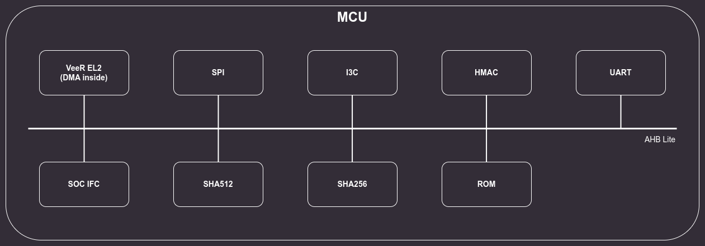

# Integration with Caliptra Subsystem

The I3C Controller is meant to be used as part of the Caliptra Subsystem.

:::{figure-md} integration

Integration of the I3C Core with Caliptra Subsystem in standard use case
:::

## Caliptra Subsystem

The Caliptra Subsystem is based on the Caliptra RTL but has trimmed functionalities and an embedded I3C Core.
It consists of:
* VeeR EL2 with DMA engine
* SPI
* I3C
* HMAC
* UART
* SOC IFC
* SHA256 & SHA512
* ROM

All listed components are connected to an AHB Lite bus that is controlled by VeeR EL2 acting as a manager.
:::{figure-md} caliptra_ss

Caliptra Subsystem block diagram
:::

### Clock

The I3C core will be using the gated `clk_cg` clock, provided by the Caliptra-SS core.

### Reset

The PON reset of the I3C core will be provided by the Caliptra-SS core.

The I3C core is responsive after PON release, so it does not provide a handshake (e.g. `BOOT_DONE`, `RST_DONE`, etc.)

### Peripheral connection interface

The I3C Core can be connected as a subordinate on either AHB or AXI bus to enable both VeeR-EL2 configurations.
The AHB/AXI interface is connected to an adapter, which enables access to the Control and Status Registers.
SystemVerilog CSR description is generated with [PeakRDL](https://github.com/SystemRDL/PeakRDL) and uses the ["Internal CPUIF Protocol"](https://peakrdl-regblock.readthedocs.io/en/latest/cpuif/internal_protocol.html).

## Controller Interface test

In test [smoke_test_i3c.c](https://github.com/chipsalliance/caliptra-ss/tree/dev-antmicro/src/mcu/test_suites/smoke_test_i3c), the I3C Core is connected via an AHB bus to the Caliptra SubSystem.
Communication with internal registers of the I3C Core is executed by using the `lsu_write_32()` and `lsu_read_32()` functions from the [riscv_hw_if.h](https://github.com/chipsalliance/caliptra-rtl/blob/a50f6d212c93827d9303b6b734152302c0ccd7cd/src/integration/test_suites/libs/riscv_hw_if/riscv_hw_if.h) Caliptra header.
Software is executed on the simulated [VeeR-EL2 core](https://github.com/chipsalliance/Cores-VeeR-EL2).
The software test executes read/write operations on different configurations of registers to check whether RTL generated from the RDL configuration behaves properly from the software point of view.

## Interrupts

Calitpra specifies required interface for interrupts which consists of two aggregator single bit signals:
* `error_intr_o` - error interrupts assigned a higher priority and expected to be infrequent,
* `notif_intr_o` - alert the processor of normal operation activity, such as completion of requested operations or arrival of SoC requests through the shared interface.

:::{list-table} *Division of interrupts between errors and notifications*
:name: tab-tti-interrupts
:widths: 10 20 13 40 17
* - **Register group**
  - **Register name**
  - **Field name**
  - **Description**
  - **Type**
* - HCI Base registers
  - INTR_STATUS
  - SCHED_CMD_MISSED_TICK_STAT
  - Scheduled commands could be executed due to controller being busy
  - **Notification**
* - HCI Base registers
  - INTR_STATUS
  - HC_ERR_CMD_SEQ_TIMEOUT_STAT
  - Command timeout after prolonged stall
  - **Error**
* - HCI Base registers
  - INTR_STATUS
  - HC_WARN_CMD_SEQ_STALL_STAT
  - Clock stalled due to lack of commands
  - **Notification**
* - HCI Base registers
  - INTR_STATUS
  - HC_SEQ_CANCEL_STAT
  - Controller had to cancel command sequence
  - **Notification**
* - HCI Base registers
  - INTR_STATUS
  - HC_INTERNAL_ERR_STAT
  - Controller internal unrecoverable error
  - **Error**
* - HCI PIO registers
  - PIO_INTR_STATUS
  - TRANSFER_ERR_STAT
  - Transfer error
  - **Error**
* - HCI PIO registers
  - PIO_INTR_STATUS
  - TRANSFER_ABORT_STAT
  - Transfer aborted
  - **Notification**
* - HCI PIO registers
  - PIO_INTR_STATUS
  - RESP_READY_STAT
  - Response queue fulfils RESP_BUF_THLD
  - **Notification**
* - HCI PIO registers
  - PIO_INTR_STATUS
  - CMD_QUEUE_READY_STAT
  - Command queue fulfils CMD_EMPTY_BUF_THLD
  - **Notification**
* - HCI PIO registers
  - PIO_INTR_STATUS
  - IBI_STATUS_THLD_STAT
  - IBI queue fulfils IBI_STATUS_THLD
  - **Notification**
* - HCI PIO registers
  - PIO_INTR_STATUS
  - RX_THLD_STAT
  - RX queue fulfils RX_BUF_THLD
  - **Notification**
* - HCI PIO registers
  - PIO_INTR_STATUS
  - TX_THLD_STAT
  - TX queue fulfils TX_BUF_THLD
  - **Notification**
* - TTI registers
  - INTERRUPT_STATUS
  - TRANSFER_ERR_STAT
  - Bus error occurred
  - **Error**
* - TTI registers
  - INTERRUPT_STATUS
  - TRANSFER_ABORT_STAT
  - Bus aborted transaction
  - **Notification**
* - TTI registers
  - INTERRUPT_STATUS
  - IBI_THLD_STAT
  - TTI IBI Buffer Threshold Status, the Target Controller shall set this bit to 1 when the number of available entries in the TTI IBI Queue is >= the value defined in `TTI_IBI_THLD`
  - **Notification**
* - TTI registers
  - INTERRUPT_STATUS
  - RX_DESC_THLD_STAT
  - TTI RX Descriptor Buffer Threshold Status, the Target Controller shall set this bit to 1 when the number of available entries in the TTI RX Descriptor Queue is >= the value defined in `TTI_RX_DESC_THLD`
  - **Notification**
* - TTI registers
  - INTERRUPT_STATUS
  - TX_DESC_THLD_STAT
  - TTI TX Descriptor Buffer Threshold Status, the Target Controller shall set this bit to 1 when the number of available entries in the TTI TX Descriptor Queue is >= the value defined in `TTI_TX_DESC_THLD`
  - **Notification**
* - TTI registers
  - INTERRUPT_STATUS
  - RX_DATA_THLD_STAT
  - TTI RX Data Buffer Threshold Status, the Target Controller shall set this bit to 1 when the number of entries in the TTI RX Data Queue is >= the value defined in `TTI_RX_DATA_THLD`
  - **Notification**
* - TTI registers
  - INTERRUPT_STATUS
  - TX_DATA_THLD_STAT
  - TTI TX Data Buffer Threshold Status, the Target Controller shall set this bit to 1 when the number of available entries in the TTI TX Data Queue is >= the value defined in `TTI_TX_DATA_THLD`
  - **Notification**
* - TTI registers
  - INTERRUPT_STATUS
  - TX_DESC_TIMEOUT
  - Pending Write was NACK’ed, because the `TX_DESC_STAT` event was not handled in time
  - **Error**
* - TTI registers
  - INTERRUPT_STATUS
  - RX_DESC_TIMEOUT
  - Pending Read was NACK’ed, because the `RX_DESC_STAT` event was not handled in time
  - **Error**
* - TTI registers
  - INTERRUPT_STATUS
  - TX_DESC_STAT
  - There is a pending Write Transaction on the I3C Bus. Software should write data to the TX Descriptor Queue and the TX Data Queue
  - **Notification**
* - TTI registers
  - INTERRUPT_STATUS
  - RX_DESC_STAT
  - There is a pending Read Transaction. Software should read data from the RX Descriptor Queue and the RX Data Queue
  - **Notification**
:::
