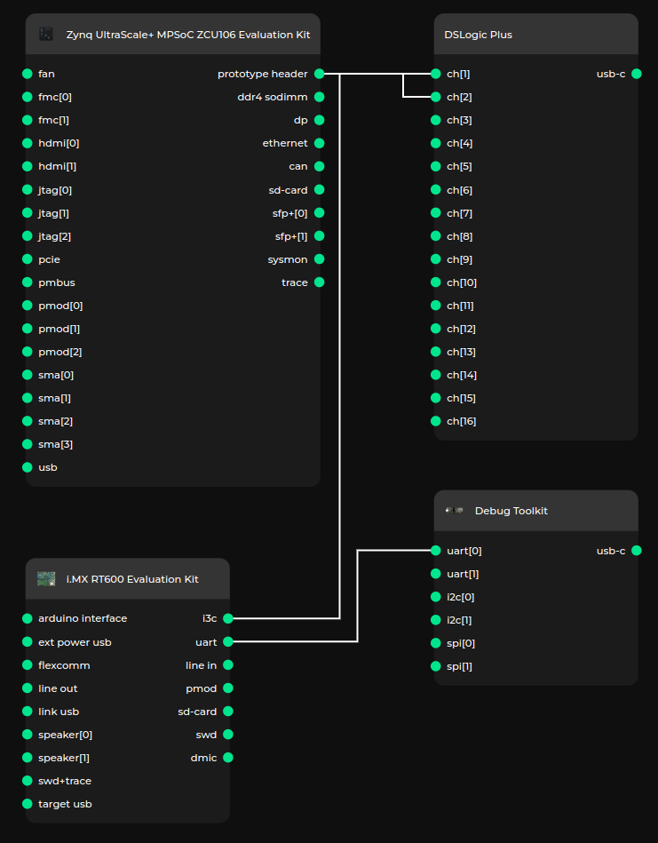

# FPGA Validation Platform

This chapter describes the FPGA Validation Platform used to test the I3C Core and its integration with the Caliptra Subsystem.

## Devices

Test setup consists of:
* [AMD Zynq UltraScale+ MPSoC ZCU106 Evaluation Kit](https://www.xilinx.com/products/boards-and-kits/zcu106.html)
* [NXP i.MX RT600 Evaluation Kit](https://www.nxp.com/design/design-center/development-boards-and-designs/i-mx-evaluation-and-development-boards/i-mx-rt600-evaluation-kit:MIMXRT685-EVK)
* [Antmicro Debug Toolkit](https://designer.antmicro.com/hardware/devices/debug-toolkit)
* [DreamSourceLab DSLogic Plus](https://www.dreamsourcelab.com/doc/DSLogic_Plus_Datasheet.pdf)

:::{figure-md} test_setup

Test setup diagram
:::

### AMD Zynq UltraScale+ MPSoC ZCU106 Evaluation Kit

The [AMD Zynq UltraScale+ MPSoC ZCU106 Evaluation Kit](https://www.xilinx.com/products/boards-and-kits/zcu106.html) is an evaluation board, on which we implemented the I3C Core.

The `I3C` bus is exposed on the J3 Prototype Header in `LVCMOS18` IO standard.

:::{list-table} I3C header on the ZCU106 Evaluation Kit
:name: i3c-header-fpga
:widths: 50 50

* - **Pin**
  - **Signal**
* - J3.4
  - GND
* - J3.8 (FPGA:L14)(L6P_AD6P_64_P)
  - SDA
* - J3.12 (FPGA:K14)(L5P_AD14P_64_P)
  - SCL
:::

:::{info}
SDA and SCL should be pulled up by external 2k{math}`\Omega` resistors to 1.8V.
:::

### NXP i.MX RT600 Evaluation Kit

The [NXP i.MX RT600 Evaluation Kit](https://www.nxp.com/design/design-center/development-boards-and-designs/i-mx-evaluation-and-development-boards/i-mx-rt600-evaluation-kit:MIMXRT685-EVK) is a microcontroller development board with a hardware I3C controller. This board was selected, because it is supported in [Zephyr](https://docs.zephyrproject.org/latest/boards/nxp/mimxrt685_evk/doc/index.html). A Zephyr based application was developed for the testing purposes.

:::{warning}
Make sure the `NXP i.MX RT600 Evaluation Kit`'s `VDDIO1` is set to 1.8V (`JP12` set to 1-2 position).
:::

The `I3C` bus is exposed on `J18` header.
:::{list-table} I3C header on the NXP Evaluation Kit
:name: i3c-header
:widths: 20 20

* - **Pin**
  - **Signal**
* - J18.1
  - SCL (P2_29_I3C0_SCL)
* - J18.2
  - SDA (P2_30_I3C0_SDA)
* - J18.3
  - PUR (P2_31_I3C0_PUR)
* - J18.4
  - GND
:::

### Antmicro Debug Toolkit
[Antmicro Debug Toolkit](https://designer.antmicro.com/hardware/devices/debug-toolkit) can be connected to [NXP i.MX RT600 Evaluation Kit](https://www.nxp.com/design/design-center/development-boards-and-designs/i-mx-evaluation-and-development-boards/i-mx-rt600-evaluation-kit:MIMXRT685-EVK) `J16` UART header for debug purposes, e.g. Zephyr uses it for logging purposes.

:::{warning}
Set jumper on appropriate channel voltage selector header, to select `3.3V` IO voltage.
:::

### DreamSourceLab DSLogic Plus

[DreamSourceLab DSLogic Plus](https://www.dreamsourcelab.com/doc/DSLogic_Plus_Datasheet.pdf) is a 16 channel logic analyzer.

It allows for capturing 2 channels in buffer mode at `400MS/s` for up to `335.54ms`.
Measurement made with this tool are recorded with `2.5ns` resolution.

## Test procedure

After I3C initialization, the test procedure begins.
The procedure consists of:

**read_test**
- reading from selected I3C register

**write_test**
- writing to the selected register

**read_test**
- reading back from the selected register

**ccc_test**
- reading configuration saved in controller (CONFIG)
- sending direct CCC:
   - disabling events (DISEC)
   - reading Provisioned ID (GETPID)
   - reading Bus Characteristics Register (GETBCR)
   - reading Device Characteristics Register (GETDCR)
   - reading Maximum Read Length (GETMRL)
   - reading Maximum Write Length (GETMWL)
   - setting new dynamic address (SETNEWDA)
   - reading device status (GETSTATUS)
   - setting Maximum Read Length (SETMRL)
   - setting Maximum Write Length (SETMWL)
   - resetting dynamic address (RSTDAA broadcast)
   - setting device's static address as the dynamic address (SETDASA)
   - enabling events (ENEC)
- sending broadcast CCC:
   - disabling events (DISEC broadcast)
   - resetting I3C peripherals (RSTACT broadcast)
   - resetting dynamic addresses (RSTDAA broadcast)
   - setting static addresses as the dynamic addresses (SETAASA broadcast)
   - setting Maximum Read Lengths (SETMRL broadcast)
   - setting Maximum Write Lengths (SETMWL broadcast)
   - enabling events (ENEC broadcast)
