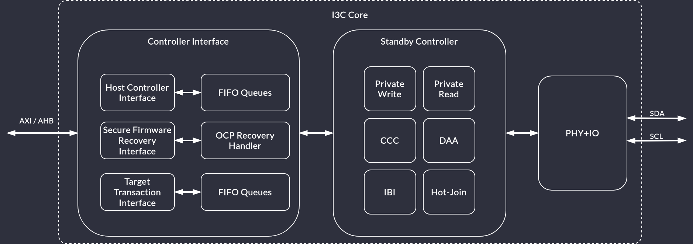

# I3C Controller

This chapter provides a top-level description of the developed I3C Basic Core, explanation of the theory of operation with relevant diagrams and an overview of the hierarchy and submodules.

## Top

The I3C Core comprises:
* Controller Interface module
* Controller logic
* PHY logic

:::{figure-md} top_level

Top level view
:::

:::{figure-md} top_level_detail

Top level view (detailed)
:::

## Controller Interface (CI)

CI defines the CSR layout and how the host should interact with them to trigger desired I3C functions.
The I3C core uses the PIO mode meaning that all interaction between it and the host happens through CSRs (as opposed to DMA mode where there's a separate path for the core to access memory).

:::{figure-md} hci

Block diagram of the Controller Interface
:::

CI defines several CSR regions:
 * Controller Capabilities and Operation registers
 * PIO access registers
 * DAT table
 * DCT table
 * Linked list of Extended Capabilities

The Device Address Table (DAT) stores per-device entries containing their addresses.
When issuing a transaction, a command contains an index to this table.

The Device Characteristic Table (DCT) is read-only (for software) and gets populated by the controller core during I3C bus initialization.

The PIO CSR region contains registers used to access Command, Read, Write and Response Queue.
See section "7.5 PIO Mode Registers (PIO_BASE +)" of the HCI specification.

### Queues

CI queues facilitate communication between software-issued requests and the I3C controller logic.
Each request is issued through appropriate ports of PIO Control register file.
The data is then collected from those ports and enqueued on appropriate queues.
CI then issues enqueued commands to the I3C controller logic and fetches transaction responses (if present).

The queues are divided accordingly to their purpose:
 * Command queue
    * 64-bit wide
    * Enqueues to-be-issued command descriptors
 * RX - Read queue
    * 32-bit wide
    * Enqueues data to be read by the host controller
 * TX - Write queue
    * 32-bit wide
    * Enqueues data written by the host controller
 * Response queue
    * 32-bit wide
    * Enqueues response descriptors of previously issued and completed commands

Both command and response descriptors are addressed with the index to the DAT table entry (as opposed to being directly-addressed).

Command descriptors are fixed to 64-bit (2-DWORD).
Response descriptors are fixed to 32-bit (1-DWORD).

For the details see [Controller Interface Queues](ci_queues.md#controller-interface-queues) section.

### DAT & DCT

To increase flexibility of the design, both DAT and DCT tables are instantiated as memories external from the I3C Core.
Access paths to these memories are routed through the Controller Interface module directly to the underlying DAT/DCT access logic.
Such approach ensures very convenient way of replacing memory models for specific target architecture.

:::{figure-md} dat_dct

Block diagram of DAT and DCT connections
:::

#### Device Address Table (DAT)

The Controller should perform initial I3C Bus enumeration after initialization.
During this process, software driver should assign static address for each device that is prior known on the bus.
Additionally, for every Dynamic Addressing capable Device, dynamic address shall be set for each valid DAT entry, as part of the Dynamic Address Assignment process.
Once the DAT is set up, devices can be assigned dynamic addresses in following ways:
* **SETDASA** (direct) and **SETAASA** (broadcast) to assign dynamic address based on static address,
* **ENTDAA** to enter dynamic address assignment procedure.

After bus initialization, the DAT is not affected by physically removing the device from the bus and can be updated by sending **SETNEWDA** (set new dynamic address) CCC or **SETGRPA** (set group address) CCC.

Dynamically addressed I3C targets with their DAT entries can be reset by sending **RSTDAA** command on the bus.
Assigned groups of addresses can be cleared by sending **RSTGRPA**.

In case the I3C Controller enters standby mode by passing the active controller role to another device, there is no requirement (on hardware) to keep the DAT table up-to-date.
However, when the I3C Controller transitions back to the Active Controller role, it should receive **DEFTGTS** CCC that provides states of all targets present on the bus.
The software driver should then update the DAT table.

Since the DAT memory is writable from software, it must support single 32-bit word masked access so that the software can write data without overwriting whole table entry.

#### Device Characteristic Table (DCT)

During dynamic address assignment, each target device on the bus must report its BCR, DCR and PID which are then saved in the Device Characteristic Table.
The only I3C command that modifies content of the DCT is **ENTDAA**.
From the software point of view, DCT memory is read only and should never be written to.

### CSR

CSRs are implemented from [SystemRDL description](https://github.com/chipsalliance/i3c-core/tree/main/src/rdl) and implementation uses [generated SV files](https://github.com/chipsalliance/i3c-core/tree/main/src/csr).

### AXI communication

This layer provides an AXI frontend to integrate the I3C controller with the designated system.
The implementation is derived from the Caliptra's implementation of the AXI subordinate, which is being developed on [branch](https://github.com/chipsalliance/caliptra-rtl/tree/cwhitehead-msft-gen2-axi-modules).

### AHB communication

This layer provides an AHB-compliant frontend to integrate the I3C controller with the designated system.
It intermediates between AHB-issued CSR access commands and controller's internal access protocol with the use of [ahb_to_reg_adapter](https://github.com/chipsalliance/caliptra-rtl/blob/9c815c335a92901b27458271a885b2128e51e687/src/libs/rtl/ahb_to_reg_adapter.sv#L24).

The AHB-Lite implementation bases on AMBA 3 AHB-Lite Protocol Specification IHI0033A.

As of now, only non-sequential transfer mode is supported.

The AHB-Lite interface is compliant with the Caliptra system and by default is parameterized with `ADDR_WIDTH=32`, `DATA_WIDTH=64`.

AHB-Lite interface allows for the following parameters to be configured:
* `AHB_DATA_WIDTH`
* `AHB_ADDR_WIDTH`

Because the size of the CSRs is fixed to 32-bits, only the lowest 32-bits of `haddress` and `hwdata` channels will be accounted for.

## I3C Controller

Main part of the system.

:::{figure-md} i3c_ctrl

Block diagram of the I3C Controller
:::

When the I3C Core acts as an Active Controller, it follows the flow presented on {numref}`i3c_flow_fsm`.

:::{figure-md} i3c_flow_fsm

FSM: Active Controller
:::

### Bus arbitration (5.1.2.2.1)

In an I3C (or multi-master I2C) system, it is possible that multiple devices connected to the bus will try to take over the bus control at the same time.
Arbitration process must occur to resolve access.
All devices that are concurrently transmitting an address follow the same rule:
1. If the current bit to transmit is a 0, then the Device shall drive SDA Low after the falling edge of SCL and hold Low until the next falling edge of SCL.
    :::{Note}
    Other Devices may also be driving SDA Low, but that is acceptable.
    :::
2. If the current bit to transmit is a 1, then the Device shall not drive SDA, but rather shall High-Z SDA on the falling edge of SCL.
    * Additionally, the Device shall monitor the SDA on the rising edge of SCL to determine whether another Device has driven SDA Low.
    * If another Device has driven the SDA Low, then the Device has "*lost*" the Arbitration and shall not further participate in this Address Header.
      That is, the Device shall not transmit any more bits, but may wait for a future START (but not a Repeated START).

:::{note}
Section 5.1.2.2.2 of the I3C specification describes possible arbitration enhancements.
:::

## Common PHY Layer

The PHY is responsible for controlling external bus signals (SDA, SCL) and synchronizing them with an internal clock. It should also support bus arbitration.
The [I2C Core](https://opentitan.org/book/hw/ip/i2c/index.html) from the Opentitan project can be used as a reference design for basic features of the PHY.

:::{figure-md} i3c_phy

Block diagram of the I3C PHY Layer
:::

### SDA and SCL lines (5.1.3.1)

Both I2C and I3C datasheets specify that SDA and SCL lines should be bidirectional, connected to an active Open Drain class Pull-Up.
Bus lines should be HIGH unless any device ties them to the GROUND.

:::{note}
In addition to the active Open Drain class Pull-Up, a High-Keeper is also required on the Bus.
The High-Keeper on the Bus shall be strong enough to prevent system leakage from pulling SDA, and sometimes SCL, Low.
The High-Keeper on the Bus shall also be weak enough that a Target with the minimum I{sub}`OL` PHY is able to pull SDA, SCL, or both Low within the Minimum t{sub}`DIG_L` period.

The High-Keeper should be implemented during physical design.
PHY driver strength modelling will not be performed in this project.
Base Controller will be delivered without the High-Keeper, however, it may become a configuration option later on.
:::

Each bus line must be capable of switching between 4 logic states:
1. No Pull-Up (High-Z)
2. High-Keeper Pull-Up
3. Open Drain Pull-Up
4. Assert LOW

The Opentitan I2C Core implements a [Virtual Open Drain](https://opentitan.org/book/hw/ip/i2c/doc/theory_of_operation.html#virtual-open-drain) functionality which seems like a good solution for implementing the desired behavior on FPGA devices while at the same time keeping it easy to use in silicon chips. Each bus line consists of 3 lines:
1. Signal input (`scl_i`, `sda_i`) - external input from the bus lines.
2. Signal output (`scl_o`, `sda_o`) - internal signal, it is tied to the GROUND.
3. Signal output enable (`scl_en_o`, `sda_en_o`) - internal signal enable, controlled by the core FSM.

This interface makes it easy to construct tri-state buffers.
The controller will never assert external bus lines HIGH since it is assumed that these lines are pulled up to V{sub}`dd` externally.
Switching from output to input is enough to achieve signals asserted HIGH.

Verilator does not natively support `x` and `z` states and their handling is explained in the [official documentation](https://verilator.org/guide/latest/languages.html?highlight=tristate#tri-inout).
Cocotb requires a wrapper to interact properly with an `inout` which is described in [Cocotb discussion #3506](https://github.com/cocotb/cocotb/discussions/3506).
Considering these limitations, PHY is being tested functionally using Cocotb and tri-state logic.
Additionally, there is a RTL testbench run in Verilator and Icarus simulators that checks whether High-Z is set properly on I3C bus lines when the controller request high bus state.

### Clock synchronization (5.1.7)

While Legacy I2C protocol requires clock synchronization between each master and bus, I3C does not need such mechanism due to the handoff procedure.
If currently active Controller wants to pass Controller privileges to another device, it should run the handoff procedure and then it shall issue a `GETACCR` command followed by a STOP condition, if the handoff was successful.
After such operation, an active Controller shall release control of the SCL line, therefore releasing control of the I3C Bus to the selected Secondary Controller.

However, signals read from the I3C bus clock domain must be synchronized to the system clock domain before they are used internally.
As a reference, OpenTitan uses a 24MHz system clock to oversample data through [two flip flops](https://github.com/lowRISC/opentitan/blob/master/hw/ip/i2c/rtl/i2c_core.sv#L390-L409).

### Mixed I2C and I3C Bus (5.1.1.2.3)

This project aims to create an I3C Primary Controller which means that we want to support all possible configurations specified by the I3C Bus specification:
1. **Pure Bus**: Only I3C Devices are present on the Bus.
2. **Mixed Fast Bus**: Both I3C Devices and Legacy I2C Devices are present on the Bus, such that the
Legacy I2C Devices are restricted to ones that are generally permissible (i.e., Target-only, and no
Target clock stretching), and that have a true I2C 50 ns Spike Filter on SCL. (I.e., I2C Devices that do not ‘see’ the SCL line as High when the High duration is less than 50 ns, across all temperatures and processes.)
3. **Mixed Slow/Limited Bus**: Both I3C Devices and Legacy I2C Devices are present on the Bus, such that the Legacy I2C Devices are restricted to ones that are generally permissible (i.e., Target-only, and no Target clock stretching), but that do not have a true I2C 50 ns Spike Filter on SCL.

While Mixed Fast Bus configuration can operate on both I2C and I3C protocols simultaneously (with certain speed limitations), Mixed Slow/Limited Bus is based on downgrading whole bus performance to the Legacy I2C protocol.
:::{note}
The Mixed Fast Bus scenario relies on the fact that Legacy I2C Devices are expected to support Legacy Virtual Register (LVR) through their **software drivers**.
:::

## Legacy I2C Mode

This project reuses [the I2C module](https://github.com/lowRISC/opentitan/tree/master/hw/ip/i2c) developed as part of [the OpenTitan Project](https://opentitan.org/). Original documentation can be [found here](https://opentitan.org/book/hw/ip/i2c/index.html).
