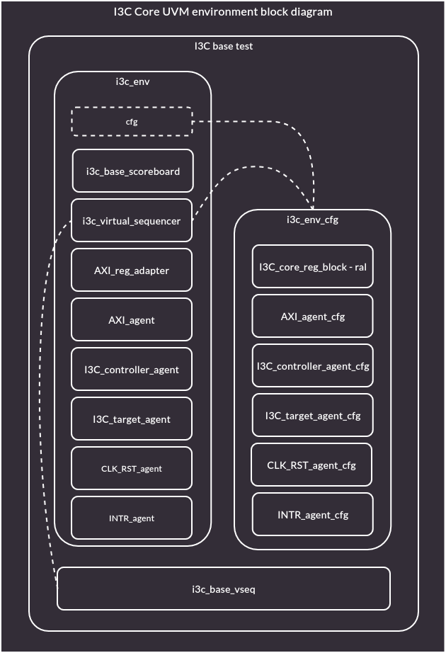

# UVM I3C

This directory contains the UVM verification environment and is organized as follows:
* `dv_inc` - Useful includes
* `dv_i3c` - I3C agent with sequences
* `i3c_core` - UVM environment and virtual sequences for the I3C_core testing

## `dv_inc`

`dv_inc` directory stores useful includes and macros:
* `dv_macros.svh` - Useful macros for UVM.

## `dv_i3c`

`dv_i3c` directory stores the I3C agent and sequences.

The I3C Agent consists of:
* `i3c_if.sv` - I3C bus interface used by I3C agent.
* `i3c_sequencer.sv` - I3C bus sequencer, inherits from uvm_sequencer and keeps default behavior.
* `i3c_seq_item.sv` - I3C sequence item, inherits from uvm_sequence_item. These objects are created in the I3C sequences and are passed to the I3C drivers.
* `i3c_monitor.sv` - I3C bus monitor, inherits from uvm_monitor.
* `i3c_item.sv` - I3C monitor item, inherits from uvm_sequence_item. These objects are created by the I3C monitor and represent observed I3C transactions.
* `i3c_driver.sv` - I3C bus driver, inherits for uvm_driver.
* `i3c_agent_pkg.sv` - I3C agent package. It contains CCC enums, I2C and I3C bus timings.
* `i3c_agent_cfg.sv` - I3C agent configuration object.
* `i3c_agent.sv` - I3C agent. It contains i3c_agent_cfg, i3c_sequencer, i3c_driver and i3c_monitor objects. It connects i3c_sequencer with i3c_driver.

The I3C Agent has its own unit tests in the `i3c_agent_unit_tests` directory:
* i3c_sequence_vseqs - I3C agent test virtual sequences.
    * `base_vseq.sv` - I3C agent test base virtual sequence, it is inherited from by other virtual I3C agent test sequences.
    * `broadcast_followed_by_data_vseq.sv` - I3C agent test that runs i3c_broadcast_followed_by_data sequence on both host and device agents.
    * `broadcast_followed_by_data_with_rstart_vseq.sv` - I3C agent test that runs i3c_broadcast_followed_by_data sequence on the device agent and broadcast_followed_by_data_with_rstart on the host agent.
    * `broadcast_followed_by_i2c_data_vseq.sv` - I3C agent test that runs i3c_broadcast_followed_by_i2c_data sequence on both host and device agents.
    * `broadcast_followed_by_i2c_data_with_rstart_vseq.sv` - I3C agent test that runs i3c_broadcast_followed_by_i2c_data sequence on the device agent and broadcast_followed_by_i2c_data_with_rstart on the host agent.
    * `direct_i2c_vseq.sv` - I3C agent test that runs i2c_direct_data sequence on both host and device agents.
    * `direct_i2c_with_rstart_vseq.sv` - I3C agent test that runs i2c_direct_data on the device agent and direct_i2c_with_rstart sequence on the host agent.
    * `direct_vseq.sv` - I3C agent test that runs i3c_direct_data sequence on both host and device agents.
    * `direct_with_rstart_vseq.sv` - I3C agent test that runs i3c_direct_data on the device agent and direct_i3c_with_rstart sequence on the host agent.
    * `i3c_sequence_vseq_list.sv` - This file includes all defined virtual sequences.
* `tb_driver.sv` - SV unit test that checks i3c_driver implementation.
* `i3c_sequencer_mock.sv` - uvm sequencer mock used in the tb_driver.sv.
* `tb_monitor.sv` - SV unit test that checks i3c_monitor implementation against capture communication.
* `digital.csv` - I3C communication capture without IBIs.
* `digital_with_ibi.csv` - I3C communication capture with IBIs.
* `i3c_sim.scr` - List of files used in the UVM agent test.
* `tb_sequencer.sv` - Top level SystemVerilog file that contains top level module for the I3C agent tests.
* `i3c_sequence_env.sv` - I3C agent test environment definition. This environment has 2 I3C agents: one in Host and the other in the Device mode. It also provides unit test virtual sequencer.
* `i3c_sequence_env_cfg.sv` - I3C agent test environment configuration.
* `i3c_sequence_env_pkg.sv` - I3C agent test environment package. It includes: i3c_sequence_env_cfg.sv, i3c_sequence_virtual_sequencer.sv i3c_sequence_env.sv and i3c_sequence_vseq_list.sv files.
* `i3c_sequence_test.sv` - I3C agent test setup, it inherits from uvm_test and setups environment with configuration. In run phase it retrieves virtual sequence and starts virtual sequencer with this virtual sequence.
* `i3c_sequence_test_pkg.sv` - i3C unit test package, it includes i3c_sequence_test.sv file.
* `i3c_sequence_virtual_sequencer.sv` - I3C agent test virtual sequencer. It inherits from uvm_sequencer and retains default behavior.

The I2C/I3C sequence library - `seq_lib` - contains:
* `i2c_direct_data_seq.sv` - Sequence in host mode sends single I2C transfer per START/STOP frame, and it begins with I2C target address. In device mode responds to every I2C transfer that begins with I2C target address.
* `i2c_direct_data_with_rstart_seq.sv` - Sequence in host mode sends multiple I2C transfers per single START/STOP frame. Transactions are divided with RSTART condition.
* `i3c_direct_data_seq.sv` - Sequence in host mode sends single I3C transfer per START/STOP frame, and it begins with I3C target address. In device mode responds to every I3C transfer that begins with I3C target address.
* `i3c_direct_data_with_rstart_seq.sv` - Sequence in host mode sends multiple I3C transfers per single START/STOP frame. Transactions are divided with RSTART condition.
* `i3c_broadcast_followed_by_i2c_data_seq.sv` - Sequence in host mode starts with I3C broadcast address (0x7E) followed by RSTART and single I2C transaction ended with STOP. In device mode sequence awaits for 0x7E address and responds to each following I2C transaction.
* `i3c_broadcast_followed_by_i2c_data_with_rstart_seq.sv` - Sequence in host mode starts with I3C broadcast address (0x7E) followed by RSTART and multiple I2C transaction.
* `i3c_broadcast_followed_by_data_seq.sv` - Sequence in host mode starts with I3C broadcast address (0x7E) followed by RSTART and single I3C transaction ended with STOP. In device mode sequence awaits for 0x7E address and responds to each following I3C transaction.
* `i3c_broadcast_followed_by_data_with_rstart_seq.sv` - Sequence in host mode starts with I3C broadcast address (0x7E) followed by RSTART and multiple I3C transaction.
* `i3c_seq_lib.sv` - This file includes all defined sequences.

## `i3c_core`

UVM environment and virtual sequences for the I3C_core testing are kept in the `i3c_core` directory:

* `tb_i3c_core.sv` - SystemVerilog file that contains top level module for the I3C core tests. It instantiates I3C_core rtl module, connects it to the AXI and I3C interfaces, then it     registers these interfaces in the uvm_config_db.
* `i3c_virtual_sequencer.sv` - I3C_core test virtual sequencer. It inherits from uvm_sequencer and retains default behavior.
* `i3c_test_pkg.sv` - I3C_core test package, it includes i3c_base_test.sv file.
* `i3c_env_cfg.sv`- I3C_core test environment configuration.
* `i3c_env.sv` - I3C_core test environment.
* `i3c_base_test.sv` - I3C_core test setup, it inherits from uvm_test and setups environment with configuration. In run phase it retrieves virtual sequence and starts virtual sequencer with this virtual sequence.
* `i3c_vseqs -` I3C_core virtual sequences:
  * `i3c_base_vseq.sv` - Base I3C_core virtual sequence. It prepares I3C and I2C device configuration.
  * `i3c_vseq_list.sv` - This file includes all defined virtual sequences.
* `i3c_env_pkg.sv` - I3C_core test environment package, it includes: i3c_env_cfg.sv, i3c_virtual_sequencer.sv, i3c_env.sv and i3c_vseq_list.sv files.
* `i3c_core_sim.scr` - List of files used in the UVM I3C_core test.

## I3C core UVM environment

Legend:
* Rounded boxes: SV Classes
* Dotted boxes: Indicated handles inside parent entity
* Dotted lines: Indicate handle to instances passed on to components

## Adding new I3C/I2C sequences

* Add the new sequence in the `dv_i3c/seq_lib` directory.
* Write your sequence definition.
* Add include with the file name to the `dv_i3c/seq_lib/i3c_seq_lib.sv`.

## Adding new I3C agent test virtual sequences

* Add the new sequence in the `dv_i3c/i3c_agent_unit_tests/i3c_sequence_vseqs` directory.
* Inherit from the `base_vseq` class.
* Write your sequence definition.
* Add include with the file name to the `dv_i3c/i3c_agent_unit_tests/i3c_sequence_vseqs/i3c_sequence_vseq_list.sv`.
* Add virtual sequence name to the `noxfile.py` in the `"uvm_vseq_test"`

## Adding new I3C_core test virtual sequences

* Add the new sequence in the `i3c_core/i3c_vseqs/` directory.
* Inherit from the `base_vseq` class.
* Write your sequence definition.
* Add include with the file name to the `i3c_core/i3c_vseqs/i3c_vseq_list.sv`.
* Add virtual sequence name to the `noxfile.py` in the `"uvm_i3c_core_vseq_test"`
